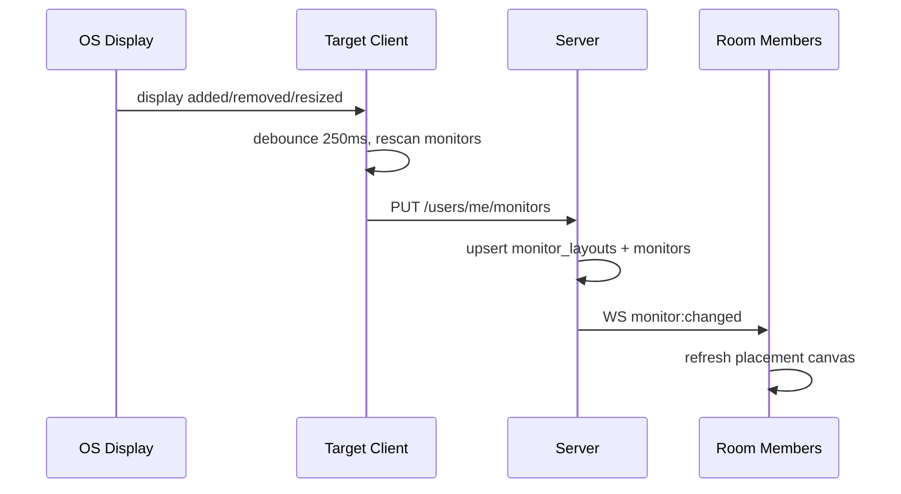

# ScreenRaid — System Architecture

> Consent-based social prank platform where friends in a private room can send temporary visual and audio overlays to each other.

---

## Table of Contents

1. [High-Level Overview](#1-high-level-overview)
2. [Technology Stack](#2-technology-stack)
3. [Monorepo Folder Structure](#3-monorepo-folder-structure)
4. [Client Architecture (Tauri)](#4-client-architecture-tauri)
5. [Server Architecture](#5-server-architecture)
6. [Database Schema](#6-database-schema)
7. [REST API Endpoints](#7-rest-api-endpoints)
8. [WebSocket Protocol](#8-websocket-protocol)
9. [Security Model](#9-security-model)
10. [Media Pipeline](#10-media-pipeline)
11. [UI / Design System](#11-ui--design-system) — see also [DESIGN_SYSTEM.md](./DESIGN_SYSTEM.md)
12. [Docker Deployment](#12-docker-deployment)
13. [Implementation Roadmap](#13-implementation-roadmap)
14. [Virtual Monitor Placement System](#14-virtual-monitor-placement-system)

---

## 1. High-Level Overview

```
┌─────────────────────────────────────────────────────────────────────────┐
│                         ScreenRaid Ecosystem                            │
├─────────────────────────────────────────────────────────────────────────┤
│                                                                         │
│  ┌──────────────┐    REST + WS     ┌──────────────┐                    │
│  │ Tauri Client │◄───────────────►│ Rust Server  │                    │
│  │ (React UI)   │                  │ (Axum)       │                    │
│  └──────┬───────┘                  └──────┬───────┘                    │
│         │                                  │                            │
│         │ Overlay Window                   │ SQLite + File Storage      │
│         ▼                                  ▼                            │
│  ┌──────────────┐                  ┌──────────────┐                    │
│  │ Multi-monitor│                  │ Media Store  │                    │
│  │ Transparent  │                  │ (local disk) │                    │
│  │ Always-on-top│                  └──────────────┘                    │
│  └──────────────┘                                                       │
│                                                                         │
└─────────────────────────────────────────────────────────────────────────┘
```

### Core Principles

| Principle | Description |
|-----------|-------------|
| **Consent-first** | Users must explicitly opt in before receiving overlays. Consent can be revoked instantly. |
| **Room isolation** | All pranks are scoped to private rooms; no cross-room leakage. |
| **Ephemeral overlays** | Overlays are time-limited and never persist on the victim's screen after duration expires. |
| **Panic safety** | One-key panic hides all overlays immediately; server-side kill switch supported. |
| **Least privilege** | Role-based permissions gate who can send, upload, or moderate. |

### Data Flow — Sending a Prank

```
Sender Client                Server                    Receiver Client
     │                          │                            │
     │── POST /rooms/:id/pranks │                            │
     │   (media_id, config)     │                            │
     │─────────────────────────►│                            │
     │                          │── validate consent ────────│
     │                          │── validate role/limits     │
     │                          │                            │
     │                          │── WS: prank:incoming ─────►│
     │                          │                            │
     │◄── WS: prank:sent ───────│                            │── download media (cache)
     │                          │                            │── render overlay
     │                          │                            │── notify user
     │                          │◄── WS: prank:ack ──────────│
```

---

## 2. Technology Stack

### Client

| Layer | Technology | Rationale |
|-------|------------|-----------|
| Shell | **Tauri 2** | Native performance, small binary, Rust backend for system APIs |
| UI | **React 19 + TypeScript** | Component ecosystem, strong typing |
| Styling | **TailwindCSS 4** | HomeBoard Anthracite Orange — flat dashboard UI (see [DESIGN_SYSTEM.md](./DESIGN_SYSTEM.md)) |
| State | **Zustand** | Lightweight global state for auth, rooms, overlay queue |
| Routing | **React Router 7** | SPA navigation inside main window |
| HTTP | **@tauri-apps/plugin-http** or `fetch` | API calls with token injection |
| WebSocket | **native WebSocket** + reconnect wrapper | Real-time prank delivery |
| Local DB | **tauri-plugin-sql** (SQLite) | Media cache metadata, settings, offline queue |
| System | **tauri-plugin-autostart**, **tauri-plugin-notification** | Windows auto-start, OS notifications |

### Server

| Layer | Technology | Rationale |
|-------|------------|-----------|
| Runtime | **Rust (Tokio)** | Async, memory-safe, shares types with client via workspace crate |
| HTTP/WS | **Axum 0.8** | Unified REST + WebSocket on one stack |
| ORM | **SQLx** | Compile-time checked SQL, SQLite + optional Postgres |
| Auth | **argon2** + **jsonwebtoken** | Password hashing, stateless JWT with refresh tokens |
| Validation | **validator** + custom MIME sniffing | Input + file validation |
| Storage | Local filesystem (dev) / **S3-compatible** (prod) | Media blobs |
| Config | **config** crate + env vars | 12-factor deployment |

### Shared

| Crate | Purpose |
|-------|---------|
| `screenraid-types` | Shared DTOs, enums, WebSocket event payloads (serde) |
| `screenraid-validation` | File type/size rules used by client upload UI and server |

---

## 3. Monorepo Folder Structure

```
ScreenRaid/
├── Cargo.toml                      # Workspace manifest
├── README.md
├── .gitignore
├── docker-compose.yml
├── .env.example
│
├── docs/
│   ├── ARCHITECTURE.md               # This document
│   ├── API.md                        # OpenAPI-style endpoint reference
│   ├── WEBSOCKET.md                  # Event catalog with examples
│   ├── DATABASE.md                   # Schema + migrations guide
│   └── DEPLOYMENT.md                 # Docker + production checklist
│
├── crates/
│   ├── screenraid-types/           # Shared types (no I/O)
│   │   ├── Cargo.toml
│   │   └── src/
│   │       ├── lib.rs
│   │       ├── auth.rs
│   │       ├── room.rs
│   │       ├── prank.rs
│   │       ├── media.rs
│   │       ├── websocket.rs
│   │       └── roles.rs
│   │
│   └── screenraid-validation/        # File validation rules
│       ├── Cargo.toml
│       └── src/
│           ├── lib.rs
│           ├── mime.rs
│           └── limits.rs
│
├── client/                           # Tauri desktop app
│   ├── package.json
│   ├── tsconfig.json
│   ├── vite.config.ts
│   ├── tailwind.config.ts
│   ├── index.html
│   ├── src-tauri/
│   │   ├── Cargo.toml
│   │   ├── tauri.conf.json
│   │   ├── capabilities/
│   │   │   └── default.json
│   │   └── src/
│   │       ├── main.rs
│   │       ├── lib.rs
│   │       ├── commands/             # Tauri IPC commands
│   │       │   ├── mod.rs
│   │       │   ├── overlay.rs        # Show/hide/panic overlays
│   │       │   ├── monitor.rs        # Multi-monitor enumeration
│   │       │   ├── settings.rs       # Local settings persistence
│   │       │   ├── cache.rs          # Media cache management
│   │       │   └── autostart.rs
│   │       ├── overlay/              # Overlay window manager
│   │       │   ├── mod.rs
│   │       │   ├── window.rs
│   │       │   ├── renderer.rs
│   │       │   └── animations.rs
│   │       └── services/
│   │           ├── websocket.rs
│   │           └── api.rs
│   │
│   └── src/                          # React frontend
│       ├── main.tsx
│       ├── App.tsx
│       ├── index.css
│       ├── types/                    # Re-exports from generated or hand-written
│       ├── stores/
│       │   ├── authStore.ts
│       │   ├── roomStore.ts
│       │   ├── overlayStore.ts
│       │   └── settingsStore.ts
│       ├── hooks/
│       │   ├── useWebSocket.ts
│       │   ├── useAuth.ts
│       │   └── useOverlayQueue.ts
│       ├── services/
│       │   ├── api.ts
│       │   ├── websocket.ts
│       │   └── cache.ts
│       ├── components/
│       │   ├── ui/                   # HomeBoard design primitives
│       │   │   ├── Card.tsx
│       │   │   ├── Button.tsx
│       │   │   ├── Input.tsx
│       │   │   ├── Badge.tsx
│       │   │   └── Modal.tsx
│       │   ├── layout/
│       │   │   ├── Sidebar.tsx
│       │   │   ├── TitleBar.tsx
│       │   │   └── MainLayout.tsx
│       │   ├── auth/
│       │   ├── rooms/
│       │   ├── friends/
│       │   ├── pranks/
│       │   ├── media/
│       │   ├── settings/
│       │   └── overlay/              # Overlay window React tree
│       │       ├── OverlayCanvas.tsx
│       │       ├── ImageOverlay.tsx
│       │       ├── VideoOverlay.tsx
│       │       ├── GifOverlay.tsx
│       │       ├── TextOverlay.tsx
│       │       └── SoundPlayer.tsx
│       └── pages/
│           ├── LoginPage.tsx
│           ├── RegisterPage.tsx
│           ├── DashboardPage.tsx
│           ├── RoomPage.tsx
│           ├── FriendsPage.tsx
│           ├── MediaLibraryPage.tsx
│           ├── SettingsPage.tsx
│           └── ConsentPage.tsx
│
└── server/                           # Axum backend
    ├── Cargo.toml
    ├── Dockerfile
    ├── migrations/                   # SQLx migrations
    │   ├── 001_initial_schema.sql
    │   ├── 002_add_consent.sql
    │   └── ...
    └── src/
        ├── main.rs
        ├── lib.rs
        ├── config.rs
        ├── error.rs
        ├── state.rs                  # AppState (db pool, ws hub, storage)
        │
        ├── domain/                   # Clean architecture — domain layer
        │   ├── mod.rs
        │   ├── user.rs
        │   ├── room.rs
        │   ├── friend.rs
        │   ├── prank.rs
        │   ├── media.rs
        │   ├── consent.rs
        │   └── role.rs
        │
        ├── repository/               # Data access
        │   ├── mod.rs
        │   ├── user_repo.rs
        │   ├── room_repo.rs
        │   ├── friend_repo.rs
        │   ├── prank_repo.rs
        │   ├── media_repo.rs
        │   └── consent_repo.rs
        │
        ├── service/                  # Business logic
        │   ├── mod.rs
        │   ├── auth_service.rs
        │   ├── room_service.rs
        │   ├── friend_service.rs
        │   ├── prank_service.rs
        │   ├── media_service.rs
        │   └── consent_service.rs
        │
        ├── api/                      # HTTP handlers
        │   ├── mod.rs
        │   ├── router.rs
        │   ├── middleware/
        │   │   ├── auth.rs
        │   │   └── rate_limit.rs
        │   └── handlers/
        │       ├── auth.rs
        │       ├── users.rs
        │       ├── rooms.rs
        │       ├── friends.rs
        │       ├── media.rs
        │       ├── pranks.rs
        │       └── consent.rs
        │
        ├── websocket/
        │   ├── mod.rs
        │   ├── hub.rs                # Connection registry per user/room
        │   ├── handler.rs
        │   └── events.rs
        │
        └── storage/
            ├── mod.rs
            ├── local.rs
            └── s3.rs
```

---

## 4. Client Architecture (Tauri)

### Window Model

| Window | Label | Properties |
|--------|-------|------------|
| **Main** | `main` | Standard app chrome; login, rooms, settings |
| **Overlay** | `overlay-{monitor_id}` | One per active monitor; `always_on_top`, `transparent`, `decorations: false`, `skip_taskbar: true` |

### Tauri Commands (IPC)

```rust
// overlay.rs
show_overlay(monitor_id, payload: OverlayPayload) -> Result<OverlayId>
hide_overlay(overlay_id) -> Result<()>
panic_hide_all() -> Result<()>
get_active_overlays() -> Result<Vec<OverlayState>>

// monitor.rs
list_monitors() -> Result<Vec<MonitorInfo>>
get_primary_monitor() -> Result<MonitorInfo>

// settings.rs
get_settings() -> Result<AppSettings>
save_settings(settings: AppSettings) -> Result<()>

// cache.rs
cache_media(url, hash) -> Result<PathBuf>
get_cached_path(media_id) -> Result<Option<PathBuf>>
clear_cache() -> Result<CleanupReport>
get_cache_size() -> Result<u64>

// autostart.rs
set_autostart(enabled: bool) -> Result<()>
is_autostart_enabled() -> Result<bool>
```

### Overlay Payload (shared type)

```typescript
interface OverlayPayload {
  id: string;
  type: 'image' | 'gif' | 'video' | 'text' | 'sound';
  media_url?: string;
  local_path?: string;
  text?: string;
  duration_ms: number;
  animation: 'fade' | 'zoom' | 'bounce' | 'none';
  position: { x: number; y: number };   // 0–1 normalized
  scale: number;                        // 0.1–2.0
  opacity: number;                      // 0–1
  volume: number;                       // 0–1 (sound/video)
  monitor_id?: number;
  sender_name: string;
}
```

### Local SQLite (client cache DB)

```sql
-- client only — stored in app data dir
CREATE TABLE cached_media (
    media_id    TEXT PRIMARY KEY,
    url         TEXT NOT NULL,
    file_path   TEXT NOT NULL,
    mime_type   TEXT NOT NULL,
    size_bytes  INTEGER NOT NULL,
    cached_at   TEXT NOT NULL DEFAULT (datetime('now')),
    expires_at  TEXT
);

CREATE TABLE app_settings (
    key   TEXT PRIMARY KEY,
    value TEXT NOT NULL
);

CREATE TABLE pending_pranks (
    id          TEXT PRIMARY KEY,
    payload     TEXT NOT NULL,  -- JSON
    received_at TEXT NOT NULL DEFAULT (datetime('now'))
);
```

### Client State Machine — Consent

```
                    ┌─────────────┐
         register   │  NO_CONSENT │◄── revoke consent
        ──────────► │  (blocked)  │
                    └──────┬──────┘
                           │ accept consent (UI + server ack)
                           ▼
                    ┌─────────────┐
                    │  CONSENTED  │──── panic / disable ──► PAUSED
                    │  (receiving)│◄──────────────────────────┘
                    └─────────────┘
```

While `PAUSED` or `NO_CONSENT`, incoming pranks are acknowledged but not rendered.

---

## 5. Server Architecture

### Layered Design

```
Request
   │
   ▼
┌─────────────┐
│ Middleware  │  auth JWT, rate limit, request ID, CORS
└──────┬──────┘
       ▼
┌─────────────┐
│  Handlers   │  Parse input, call service, map to HTTP
└──────┬──────┘
       ▼
┌─────────────┐
│  Services   │  Business rules, consent checks, role checks
└──────┬──────┘
       ▼
┌─────────────┐
│ Repository  │  SQLx queries
└──────┬──────┘
       ▼
   SQLite + Storage
```

### WebSocket Hub

- Connections indexed by `user_id` (a user may have multiple devices).
- Room subscriptions: when user joins room WS channel, they receive room-scoped events.
- Heartbeat: `ping` / `pong` every 30s; disconnect after 3 missed pongs.
- On prank dispatch: fan-out to all consented, non-paused members in target room except optional sender echo.

### Role Hierarchy

| Role | Permissions |
|------|-------------|
| `owner` | Delete room, transfer ownership, assign roles, unlimited uploads |
| `admin` | Kick members, moderate media, send pranks |
| `member` | Send pranks (if consented targets), upload within limits |
| `guest` | View room, receive only (cannot send) |

---

## 6. Database Schema

### Entity Relationship Diagram

```
users ─────────────┬────────────── user_sessions
  │                │
  │                ├────────────── friendships
  │                │
  │                └────────────── room_members ──── rooms
  │                                      │
  ├──────────── media ◄──────────────────┤
  │                                      │
  ├──────────── pranks ──────────────────┘
  │
  └──────────── user_consent
```

### Full Schema (SQLite)

```sql
-- ============================================================
-- USERS & AUTH
-- ============================================================

CREATE TABLE users (
    id              TEXT PRIMARY KEY,          -- UUID v4
    username        TEXT NOT NULL UNIQUE,
    email           TEXT NOT NULL UNIQUE,
    password_hash   TEXT NOT NULL,             -- argon2id
    display_name    TEXT NOT NULL,
    avatar_url      TEXT,
    is_active       INTEGER NOT NULL DEFAULT 1,
    created_at      TEXT NOT NULL DEFAULT (datetime('now')),
    updated_at      TEXT NOT NULL DEFAULT (datetime('now'))
);

CREATE INDEX idx_users_username ON users(username);
CREATE INDEX idx_users_email ON users(email);

CREATE TABLE refresh_tokens (
    id              TEXT PRIMARY KEY,
    user_id         TEXT NOT NULL REFERENCES users(id) ON DELETE CASCADE,
    token_hash      TEXT NOT NULL UNIQUE,
    expires_at      TEXT NOT NULL,
    created_at      TEXT NOT NULL DEFAULT (datetime('now')),
    revoked_at      TEXT
);

CREATE INDEX idx_refresh_tokens_user ON refresh_tokens(user_id);

-- ============================================================
-- ROOMS
-- ============================================================

CREATE TABLE rooms (
    id              TEXT PRIMARY KEY,
    name            TEXT NOT NULL,
    invite_code     TEXT NOT NULL UNIQUE,      -- 8-char alphanumeric
    owner_id        TEXT NOT NULL REFERENCES users(id),
    max_members     INTEGER NOT NULL DEFAULT 20,
    is_active       INTEGER NOT NULL DEFAULT 1,
    created_at      TEXT NOT NULL DEFAULT (datetime('now')),
    updated_at      TEXT NOT NULL DEFAULT (datetime('now'))
);

CREATE INDEX idx_rooms_invite_code ON rooms(invite_code);
CREATE INDEX idx_rooms_owner ON rooms(owner_id);

CREATE TABLE room_members (
    room_id         TEXT NOT NULL REFERENCES rooms(id) ON DELETE CASCADE,
    user_id         TEXT NOT NULL REFERENCES users(id) ON DELETE CASCADE,
    role            TEXT NOT NULL DEFAULT 'member'
                    CHECK (role IN ('owner', 'admin', 'member', 'guest')),
    joined_at       TEXT NOT NULL DEFAULT (datetime('now')),
    PRIMARY KEY (room_id, user_id)
);

CREATE INDEX idx_room_members_user ON room_members(user_id);

-- ============================================================
-- FRIENDS
-- ============================================================

CREATE TABLE friendships (
    id              TEXT PRIMARY KEY,
    requester_id    TEXT NOT NULL REFERENCES users(id) ON DELETE CASCADE,
    addressee_id    TEXT NOT NULL REFERENCES users(id) ON DELETE CASCADE,
    status          TEXT NOT NULL DEFAULT 'pending'
                    CHECK (status IN ('pending', 'accepted', 'blocked')),
    created_at      TEXT NOT NULL DEFAULT (datetime('now')),
    updated_at      TEXT NOT NULL DEFAULT (datetime('now')),
    UNIQUE (requester_id, addressee_id)
);

CREATE INDEX idx_friendships_requester ON friendships(requester_id);
CREATE INDEX idx_friendships_addressee ON friendships(addressee_id);
CREATE INDEX idx_friendships_status ON friendships(status);

-- ============================================================
-- CONSENT
-- ============================================================

CREATE TABLE user_consent (
    user_id         TEXT PRIMARY KEY REFERENCES users(id) ON DELETE CASCADE,
    global_consent  INTEGER NOT NULL DEFAULT 0,    -- master switch
    is_paused       INTEGER NOT NULL DEFAULT 0,    -- panic / temporary pause
    room_consents   TEXT NOT NULL DEFAULT '{}',    -- JSON: { room_id: bool }
    consented_at    TEXT,
    updated_at      TEXT NOT NULL DEFAULT (datetime('now'))
);

-- ============================================================
-- MEDIA
-- ============================================================

CREATE TABLE media (
    id              TEXT PRIMARY KEY,
    uploader_id     TEXT NOT NULL REFERENCES users(id),
    room_id         TEXT REFERENCES rooms(id) ON DELETE SET NULL,
    filename        TEXT NOT NULL,
    original_name   TEXT NOT NULL,
    mime_type       TEXT NOT NULL,
    size_bytes      INTEGER NOT NULL,
    media_type      TEXT NOT NULL
                    CHECK (media_type IN ('image', 'gif', 'video', 'audio')),
    storage_path    TEXT NOT NULL,
    hash_sha256     TEXT NOT NULL,
    duration_ms     INTEGER,                       -- for video/audio
    width           INTEGER,
    height          INTEGER,
    is_approved     INTEGER NOT NULL DEFAULT 1,
    created_at      TEXT NOT NULL DEFAULT (datetime('now'))
);

CREATE INDEX idx_media_uploader ON media(uploader_id);
CREATE INDEX idx_media_room ON media(room_id);
CREATE INDEX idx_media_hash ON media(hash_sha256);

-- ============================================================
-- PRANKS
-- ============================================================

CREATE TABLE pranks (
    id              TEXT PRIMARY KEY,
    room_id         TEXT NOT NULL REFERENCES rooms(id) ON DELETE CASCADE,
    sender_id       TEXT NOT NULL REFERENCES users(id),
    target_id       TEXT REFERENCES users(id),     -- NULL = broadcast to room
    media_id        TEXT REFERENCES media(id),
    overlay_type    TEXT NOT NULL
                    CHECK (overlay_type IN ('image', 'gif', 'video', 'text', 'sound')),
    text_content    TEXT,
    config          TEXT NOT NULL DEFAULT '{}',    -- JSON: animation, position, scale, etc.
    duration_ms     INTEGER NOT NULL DEFAULT 5000,
    status          TEXT NOT NULL DEFAULT 'pending'
                    CHECK (status IN ('pending', 'delivered', 'acked', 'blocked', 'expired')),
    created_at      TEXT NOT NULL DEFAULT (datetime('now')),
    delivered_at    TEXT,
    expires_at      TEXT NOT NULL
);

CREATE INDEX idx_pranks_room ON pranks(room_id);
CREATE INDEX idx_pranks_sender ON pranks(sender_id);
CREATE INDEX idx_pranks_target ON pranks(target_id);
CREATE INDEX idx_pranks_status ON pranks(status);

-- ============================================================
-- AUDIT / RATE LIMITING
-- ============================================================

CREATE TABLE audit_log (
    id              TEXT PRIMARY KEY,
    user_id         TEXT REFERENCES users(id),
    action          TEXT NOT NULL,
    resource_type   TEXT,
    resource_id     TEXT,
    metadata        TEXT,                          -- JSON
    ip_address      TEXT,
    created_at      TEXT NOT NULL DEFAULT (datetime('now'))
);

CREATE INDEX idx_audit_user ON audit_log(user_id);
CREATE INDEX idx_audit_created ON audit_log(created_at);

CREATE TABLE upload_quotas (
    user_id         TEXT NOT NULL REFERENCES users(id) ON DELETE CASCADE,
    date            TEXT NOT NULL,                 -- YYYY-MM-DD
    upload_count    INTEGER NOT NULL DEFAULT 0,
    bytes_uploaded  INTEGER NOT NULL DEFAULT 0,
    PRIMARY KEY (user_id, date)
);
```

### Config JSON Schema (`pranks.config` / overlay)

```json
{
  "animation": "fade",
  "position": { "x": 0.5, "y": 0.5 },
  "scale": 1.0,
  "opacity": 1.0,
  "volume": 0.8,
  "monitor_id": null,
  "z_index": 1000
}
```

---

## 7. REST API Endpoints

Base URL: `https://api.screenraid.example/v1`

All authenticated routes require header: `Authorization: Bearer <access_token>`

### Auth

| Method | Path | Auth | Description |
|--------|------|------|-------------|
| `POST` | `/auth/register` | No | Create account |
| `POST` | `/auth/login` | No | Login, returns access + refresh tokens |
| `POST` | `/auth/refresh` | Refresh token | Rotate access token |
| `POST` | `/auth/logout` | Yes | Revoke refresh token |
| `GET` | `/auth/me` | Yes | Current user profile |

**Register body:**
```json
{
  "username": "prankster42",
  "email": "user@example.com",
  "password": "securePassword123!",
  "display_name": "Prankster"
}
```

**Login response:**
```json
{
  "access_token": "eyJ...",
  "refresh_token": "uuid...",
  "expires_in": 900,
  "user": { "id": "...", "username": "...", "display_name": "..." }
}
```

### Users

| Method | Path | Auth | Description |
|--------|------|------|-------------|
| `GET` | `/users/:id` | Yes | Public profile |
| `PATCH` | `/users/me` | Yes | Update display name, avatar |
| `GET` | `/users/search?q=` | Yes | Search users by username |

### Friends

| Method | Path | Auth | Description |
|--------|------|------|-------------|
| `GET` | `/friends` | Yes | List friends (accepted) |
| `GET` | `/friends/requests` | Yes | Pending incoming/outgoing |
| `POST` | `/friends/request` | Yes | Send friend request `{ "user_id": "..." }` |
| `POST` | `/friends/:id/accept` | Yes | Accept request |
| `POST` | `/friends/:id/decline` | Yes | Decline request |
| `DELETE` | `/friends/:id` | Yes | Remove friend |
| `POST` | `/friends/:id/block` | Yes | Block user |

### Rooms

| Method | Path | Auth | Description |
|--------|------|------|-------------|
| `GET` | `/rooms` | Yes | List user's rooms |
| `POST` | `/rooms` | Yes | Create room `{ "name": "Squad" }` |
| `GET` | `/rooms/:id` | Member | Room details + members |
| `PATCH` | `/rooms/:id` | Admin+ | Update name, max_members |
| `DELETE` | `/rooms/:id` | Owner | Delete room |
| `POST` | `/rooms/join` | Yes | Join via `{ "invite_code": "ABC12345" }` |
| `POST` | `/rooms/:id/leave` | Member | Leave room |
| `GET` | `/rooms/:id/members` | Member | List members with roles |
| `PATCH` | `/rooms/:id/members/:userId` | Admin+ | Change role |
| `DELETE` | `/rooms/:id/members/:userId` | Admin+ | Kick member |
| `POST` | `/rooms/:id/transfer` | Owner | Transfer ownership |

### Consent

| Method | Path | Auth | Description |
|--------|------|------|-------------|
| `GET` | `/consent` | Yes | Get consent state |
| `POST` | `/consent/grant` | Yes | Grant global consent |
| `POST` | `/consent/revoke` | Yes | Revoke global consent |
| `POST` | `/consent/pause` | Yes | Panic pause (temporary) |
| `POST` | `/consent/resume` | Yes | Resume after pause |
| `PATCH` | `/consent/rooms/:roomId` | Yes | Per-room consent `{ "consented": true }` |

### Media

| Method | Path | Auth | Description |
|--------|------|------|-------------|
| `GET` | `/media` | Yes | List user's uploads `?room_id=` |
| `POST` | `/media/upload` | Yes | Multipart upload (see limits) |
| `GET` | `/media/:id` | Yes | Metadata |
| `GET` | `/media/:id/file` | Yes | Download/stream file |
| `DELETE` | `/media/:id` | Owner/Admin | Delete media |

**Upload limits (enforced server + shared crate):**

| Type | Max size | Allowed MIME |
|------|----------|--------------|
| Image | 10 MB | `image/png`, `image/jpeg`, `image/webp` |
| GIF | 15 MB | `image/gif` |
| Video | 50 MB | `video/mp4`, `video/webm` |
| Audio | 10 MB | `audio/mpeg`, `audio/wav`, `audio/ogg` |

### Pranks

| Method | Path | Auth | Description |
|--------|------|------|-------------|
| `POST` | `/rooms/:id/pranks` | Member+ | Send prank |
| `GET` | `/rooms/:id/pranks` | Member | History (paginated) |
| `GET` | `/pranks/:id` | Involved | Prank detail |
| `POST` | `/pranks/:id/ack` | Target | Acknowledge delivery |

**Send prank body:**
```json
{
  "target_id": "user-uuid-or-null",
  "media_id": "media-uuid",
  "overlay_type": "image",
  "text_content": null,
  "duration_ms": 8000,
  "config": {
    "animation": "bounce",
    "position": { "x": 0.5, "y": 0.3 },
    "scale": 1.2,
    "opacity": 0.95,
    "volume": 0.7
  }
}
```

### Health

| Method | Path | Auth | Description |
|--------|------|------|-------------|
| `GET` | `/health` | No | `{ "status": "ok" }` |
| `GET` | `/health/ready` | No | DB + storage check |

### Error Format

```json
{
  "error": {
    "code": "CONSENT_REQUIRED",
    "message": "Target user has not granted consent",
    "details": {}
  }
}
```

**Standard error codes:** `UNAUTHORIZED`, `FORBIDDEN`, `NOT_FOUND`, `VALIDATION_ERROR`, `RATE_LIMITED`, `CONSENT_REQUIRED`, `CONSENT_PAUSED`, `UPLOAD_LIMIT_EXCEEDED`, `INVALID_FILE_TYPE`, `ROOM_FULL`, `INSUFFICIENT_ROLE`

---

## 8. WebSocket Protocol

**Endpoint:** `wss://api.screenraid.example/v1/ws?token=<access_token>`

### Envelope Format

All messages use a common envelope:

```json
{
  "type": "event_name",
  "payload": { },
  "timestamp": "2026-06-24T12:00:00Z",
  "request_id": "optional-uuid"
}
```

### Client → Server Events

| Event | Payload | Description |
|-------|---------|-------------|
| `ping` | `{}` | Heartbeat |
| `subscribe_room` | `{ "room_id": "uuid" }` | Subscribe to room events |
| `unsubscribe_room` | `{ "room_id": "uuid" }` | Unsubscribe |
| `prank:ack` | `{ "prank_id": "uuid" }` | Confirm overlay rendered |
| `presence:update` | `{ "status": "online" \| "away" \| "dnd" }` | Update presence |
| `consent:sync` | `{ "global_consent": true, "is_paused": false }` | Client consent state sync |

### Server → Client Events

| Event | Payload | Description |
|-------|---------|-------------|
| `pong` | `{}` | Heartbeat reply |
| `connected` | `{ "user_id": "uuid", "session_id": "uuid" }` | Connection established |
| `error` | `{ "code": "...", "message": "..." }` | Protocol or auth error |
| `prank:incoming` | See below | New prank to render |
| `prank:sent` | `{ "prank_id": "uuid", "status": "delivered" }` | Confirmation to sender |
| `prank:blocked` | `{ "prank_id": "uuid", "reason": "CONSENT_PAUSED" }` | Prank blocked (sender notification) |
| `room:member_joined` | `{ "room_id", "user": { id, display_name, avatar_url } }` | |
| `room:member_left` | `{ "room_id", "user_id" }` | |
| `room:member_role_changed` | `{ "room_id", "user_id", "role" }` | |
| `friend:request` | `{ "from": UserSummary }` | Incoming friend request |
| `friend:accepted` | `{ "user": UserSummary }` | Friend accepted |
| `consent:updated` | `{ "user_id", "global_consent", "is_paused" }` | Room member consent changed |
| `presence:changed` | `{ "user_id", "status" }` | Friend/room member presence |

### `prank:incoming` Payload

```json
{
  "prank_id": "uuid",
  "room_id": "uuid",
  "sender": {
    "id": "uuid",
    "display_name": "Prankster",
    "avatar_url": null
  },
  "overlay_type": "gif",
  "media": {
    "id": "uuid",
    "url": "/v1/media/uuid/file",
    "mime_type": "image/gif",
    "hash_sha256": "abc..."
  },
  "text_content": null,
  "duration_ms": 6000,
  "config": {
    "animation": "zoom",
    "position": { "x": 0.5, "y": 0.5 },
    "scale": 1.0,
    "opacity": 1.0,
    "volume": 0.8,
    "monitor_id": null
  },
  "expires_at": "2026-06-24T12:01:00Z"
}
```

### Reconnection Strategy

1. Exponential backoff: 1s → 2s → 4s → … → 30s cap.
2. On reconnect: re-authenticate, re-subscribe active rooms.
3. Server replays undelivered pranks from last 60 seconds if `prank:ack` missing.

---

## 9. Security Model

### Authentication

- **Access token:** JWT, 15 min TTL, contains `sub` (user_id), `sid` (session).
- **Refresh token:** Opaque UUID, 30 days, stored hashed in DB, rotatable.
- Passwords: **argon2id** with per-user salt.

### Authorization Matrix

| Action | Required |
|--------|----------|
| Send prank | Room `member`+, target has consent, not paused |
| Upload media | Room `member`+, within daily quota |
| Kick member | Room `admin`+ |
| Delete room | Room `owner` |

### Consent Enforcement (defense in depth)

1. **Server:** Reject prank if target `global_consent = false`, `is_paused = true`, or per-room consent false.
2. **WebSocket:** Do not emit `prank:incoming` to non-consented sessions.
3. **Client:** Final gate — overlay manager checks local consent cache before render.

### File Validation Pipeline

```
Upload → size check → extension allowlist → magic-byte MIME sniff
       → hash compute → malware scan hook (optional ClamAV)
       → store with content-disposition → record metadata
```

### Rate Limits

| Endpoint | Limit |
|----------|-------|
| Login | 5 / min / IP |
| Register | 3 / hour / IP |
| Upload | 20 / hour / user |
| Send prank | 30 / min / user / room |

### Panic Button

- **Client:** `panic_hide_all()` immediately hides all overlay windows; sets local `is_paused = true`; fires `POST /consent/pause` async.
- **Global hotkey:** Configurable (default `Ctrl+Shift+Escape`), registered via Tauri global shortcut.

---

## 10. Media Pipeline

```
┌──────────┐    upload     ┌──────────┐    URL     ┌──────────────┐
│  Client  │──────────────►│  Server  │───────────►│ Blob Storage │
└──────────┘               └──────────┘            └──────────────┘
      │                          │
      │  prank:incoming          │  metadata in SQLite
      │◄─────────────────────────┤
      │                          │
      ▼                          │
┌──────────────┐                 │
│ Download to  │                 │
│ local cache  │◄────────────────┘
└──────┬───────┘
       │
       ▼
┌──────────────┐
│ Render in  │
│ overlay win│
└──────────────┘
```

- Cache keyed by `media_id` + `hash_sha256`.
- LRU eviction when cache exceeds user-configurable limit (default 500 MB).
- GIF: render via `` or canvas decoder.
- Video: HTML5 `<video>` with autoplay in overlay window.
- Sound: Web Audio API or `<audio>` element (no visual overlay).

---

## 11. UI / Design System

> **Canonical reference:** [DESIGN_SYSTEM.md](./DESIGN_SYSTEM.md)  
> HomeBoard design language — Dashboard Anthracite Orange. Flat modern UI. **No glassmorphism. No neon.**

### Theme — Dashboard Anthracite Orange

| Token | Hex | Usage |
|-------|-----|-------|
| Background | `#1a1a1a` | App/page base |
| Surface | `#232323` | Sidebar, title bar |
| Card | `#2f2f2f` | Cards, modals, inputs |
| Border | `#3a3a3a` | Dividers, outlines |
| Accent | `#f97316` | CTAs, active nav, focus |
| Accent Hover | `#ea580c` | Hover states |
| Text | `#ececec` | Primary text |
| Secondary Text | `#b4b4b4` | Captions, meta |

### Typography & Shape

- **Font:** Inter (400/500/600/700)
- **Card radius:** 16px (`rounded-2xl`)
- **Style:** Clean dashboard / admin-panel layout
- **References:** Discord, Steam, modern self-hosted dashboards

### Layout (Discord / Steam inspired)

```
┌────────────────────────────────────────────────────┐
│ TitleBar (surface #232323)                         │
├──────────┬─────────────────────────────────────────┤
│ Sidebar  │  Main Content (bg #1a1a1a)            │
│ surface  │  ┌─────────────────────────────────┐   │
│ Rooms    │  │ Card #2f2f2f · rounded-2xl      │   │
│ Friends  │  └─────────────────────────────────┘   │
│ Media    │                                         │
│ Settings │                                         │
│ ──────── │                                         │
│ User     │                                         │
│ [Panic]  │  ← danger red, not accent orange       │
└──────────┴─────────────────────────────────────────┘
```

### UI Components (`client/src/components/ui/`)

`Card`, `Button`, `Input`, `Badge`, `Modal` — solid flat surfaces only.

### Key Screens

1. **Consent gate** — Centered card on dark bg; explicit opt-in required.
2. **Dashboard** — Stat cards, active rooms, recent pranks, friends online.
3. **Room view** — Member list, prank composer, media picker.
4. **Settings** — Auto-start, hotkeys, cache, volume, monitor selection.

---

## 12. Docker Deployment

### `docker-compose.yml` (outline)

```yaml
services:
  server:
    build: ./server
    ports:
      - "8080:8080"
    environment:
      - DATABASE_URL=sqlite:///data/screenraid.db
      - JWT_SECRET=${JWT_SECRET}
      - STORAGE_PATH=/data/media
      - RUST_LOG=info
    volumes:
      - screenraid-data:/data

  # Optional: reverse proxy
  caddy:
    image: caddy:2-alpine
    ports:
      - "443:443"
    volumes:
      - ./deploy/Caddyfile:/etc/caddy/Caddyfile

volumes:
  screenraid-data:
```

### Server Dockerfile (multi-stage)

```dockerfile
# Build stage: rust:1.85-bookworm
# Runtime: debian:bookworm-slim
# Copies binary + migrations
# Entrypoint: run migrations then start server
```

### Environment Variables

| Variable | Required | Description |
|----------|----------|-------------|
| `DATABASE_URL` | Yes | `sqlite://./screenraid.db` or Postgres URL |
| `JWT_SECRET` | Yes | 256-bit secret |
| `STORAGE_PATH` | Yes | Media filesystem root |
| `HOST` | No | Default `0.0.0.0` |
| `PORT` | No | Default `8080` |
| `CORS_ORIGINS` | No | Comma-separated |
| `MAX_UPLOAD_BYTES` | No | Global cap override |

---

## 13. Implementation Roadmap

### Phase 0 — Foundation (Week 1)

- [ ] Initialize Cargo workspace + `screenraid-types` crate
- [ ] Initialize Tauri 2 + React + Tailwind client scaffold
- [ ] Initialize Axum server scaffold
- [ ] SQLx migrations: `001_initial_schema.sql`
- [ ] Docker Compose for local server
- [ ] CI: `cargo check`, `cargo test`, `npm run build`

**Exit criteria:** Both binaries compile; health endpoint returns 200.

---

### Phase 1 — Auth & Users (Week 2)

- [ ] User registration/login (argon2 + JWT)
- [ ] Refresh token rotation
- [ ] Client login/register pages (HomeBoard Anthracite Orange theme)
- [ ] Auth middleware + protected routes
- [ ] Client auth store + token persistence (secure store)

**Exit criteria:** User can register, login, and see profile on client.

---

### Phase 2 — Rooms & Friends (Week 3)

- [ ] Room CRUD + invite codes
- [ ] Join/leave/kick + role management
- [ ] Friend request flow
- [ ] Client: sidebar, room list, friend list pages
- [ ] WebSocket hub scaffold + `connected` event

**Exit criteria:** Two users can join same room and see each other online.

---

### Phase 3 — Consent & Security (Week 4)

- [ ] Consent API (grant/revoke/pause/per-room)
- [ ] Server-side consent checks in prank pipeline
- [ ] Client consent gate UI
- [ ] Panic button (UI + global hotkey + `panic_hide_all`)
- [ ] Rate limiting middleware

**Exit criteria:** Pranks blocked without consent; panic instantly hides overlays.

---

### Phase 4 — Media Upload (Week 5)

- [ ] Multipart upload handler
- [ ] File validation (`screenraid-validation` crate)
- [ ] Storage backend (local)
- [ ] Media library UI
- [ ] Client media cache (SQLite + filesystem)

**Exit criteria:** User uploads GIF; file appears in room media library.

---

### Phase 5 — Prank Pipeline (Week 6)

- [ ] `POST /rooms/:id/pranks` with full validation
- [ ] WebSocket `prank:incoming` / `prank:ack` / `prank:sent`
- [ ] Client WebSocket service + reconnect
- [ ] Prank composer UI (pick media, target, duration, animation)

**Exit criteria:** Sender triggers prank; receiver gets WS event and notification.

---

### Phase 6 — Overlay Engine (Week 7–8)

- [ ] Tauri overlay window per monitor (transparent, always-on-top)
- [ ] Multi-monitor enumeration
- [ ] Image/GIF/video/text/sound renderers
- [ ] Animations: fade, zoom, bounce (CSS + requestAnimationFrame)
- [ ] Duration timer + auto-dismiss
- [ ] Volume control

**Exit criteria:** Full prank loop — send GIF overlay, appears on correct monitor, auto-hides.

---

### Phase 7 — Polish & Settings (Week 9)

- [ ] Settings page: auto-start, cache limit, default duration/volume
- [ ] OS notifications on prank received
- [ ] Prank history view
- [ ] Presence indicators
- [ ] Responsive layout pass
- [ ] Error boundaries + toast system

**Exit criteria:** Production-quality UX on 1080p and 1440p displays.

---

### Phase 8 — Hardening & Deploy (Week 10)

- [ ] Audit logging
- [ ] Integration tests (API + WS)
- [ ] Security review checklist
- [ ] Docker production image
- [ ] `docs/DEPLOYMENT.md` finalization
- [ ] README with quick-start

**Exit criteria:** Server deploys via Docker; client connects to remote server.

---

### Future Enhancements (Post-MVP)

- Prank templates / presets
- Scheduled pranks
- Reaction emojis on received pranks
- Steam-style rich presence
- Mobile companion (view-only)
- ClamAV integration
- Postgres + S3 for scale-out
- End-to-end encryption for media URLs

---

## 14. Virtual Monitor Placement System

> Users **never** see another user's screen. Clients share **monitor topology metadata** only so senders can place overlays on a virtual canvas that mirrors the target's layout.

### Responsibilities

| Component | Responsibility |
|-----------|----------------|
| **Client monitor collector** | Enumerate monitors via Tauri/OS APIs: resolution, position, DPI scale, primary flag |
| **Monitor sync service** | `PUT /users/me/monitors` on login, hotplug, and display change |
| **Server store** | Persist `monitor_layouts` + `monitors` rows per user |
| **Room exposure** | Room members fetch `GET /users/{id}/monitors` for placement targets |
| **Placement canvas (UI)** | Figma-style drag-and-drop on virtual monitor preview |
| **Coordinate transform** | Normalized `0.0–1.0` coords → physical pixels at render time |

### Architecture

```
┌─────────────────┐     PUT /users/me/monitors     ┌─────────────────┐
│  Client A       │───────────────────────────────►│  Server         │
│  (target)       │     monitor topology JSON      │  SQLite         │
│  Tauri Monitor  │                                │  monitor_layouts│
│  API            │◄────── monitor:changed ────────│  monitors       │
└─────────────────┘         (WebSocket)            └────────┬────────┘
                                                              │
┌─────────────────┐     GET /users/{id}/monitors              │
│  Client B       │◄────────────────────────────────────────┘
│  (sender)       │
│  MonitorCanvas  │──► normalized position (0.5, 0.5)
│  drag & drop    │         │
└─────────────────┘         ▼
                     POST /rooms/:id/pranks
                     config.position = { x: 0.5, y: 0.5, monitor_index: 0 }
                              │
                              ▼
                     ┌─────────────────┐
                     │  Client A       │
                     │  Overlay Engine │──► render at center of monitor 0
                     │  (no streaming) │    regardless of 1080p vs 4K
                     └─────────────────┘
```

### Data Flow — Placement

```
1. Target client boots → collect MonitorInfo[] from OS
2. Target → PUT /users/me/monitors → server upserts layout
3. Target → WS monitor:update → server broadcasts monitor:changed to room subscribers
4. Sender opens Room → GET /users/{target_id}/monitors
5. Sender drags GIF to center of virtual Monitor 1 → canvas (x: 0.50, y: 0.50)
6. Sender → POST prank with OverlayTargetPosition { monitor_index: 0, x: 0.5, y: 0.5 }
7. Receiver overlay engine: pixel_x = monitor.x + x * monitor.width
8. Overlay renders — sender never received screen pixels
```

### Hotplug



### Privacy Boundary

| Transmitted | Never transmitted |
|-------------|-------------------|
| Resolution, count, x/y positions | Screen pixels |
| DPI scale factor | Window contents |
| Primary monitor index | Application list |
| Monitor names (optional) | Desktop screenshots |

See [SECURITY.md](./SECURITY.md) § Monitor Metadata, [OVERLAY_ENGINE.md](./OVERLAY_ENGINE.md) § Virtual Placement Mode, [WIREFRAMES.md](./WIREFRAMES.md) § Visual Placement Canvas.

---

## Appendix A — Shared Type Examples (Rust)

```rust
// crates/screenraid-types/src/roles.rs
pub enum RoomRole { Owner, Admin, Member, Guest }

// crates/screenraid-types/src/prank.rs
pub enum OverlayType { Image, Gif, Video, Text, Sound }
pub enum Animation { Fade, Zoom, Bounce, None }

pub struct OverlayConfig {
    pub animation: Animation,
    pub position: OverlayTargetPosition,
    pub scale: f32,
    pub opacity: f32,
    pub volume: f32,
}

pub struct OverlayTargetPosition {
    pub monitor_index: u32,
    pub x: f32,  // 0.0–1.0 normalized
    pub y: f32,
    pub preset: PlacementPreset,
}
```

## Appendix B — Client ↔ Server Config

```json
// client/src-tauri/tauri.conf.json (key settings)
{
  "app": {
    "windows": [
      { "label": "main", "width": 1200, "height": 800, "decorations": false }
    ]
  }
}
```

---

*Document version: 1.0.0 — Generated for ScreenRaid initial implementation.*
