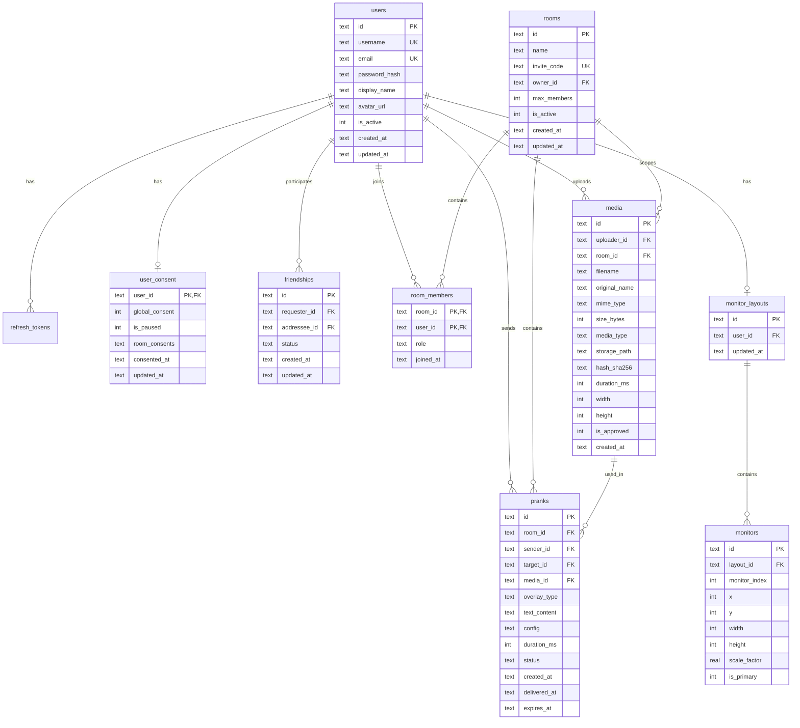

# ScreenRaid Database Schema

**Production (D1):** migrations in [`cloud/migrations/`](../cloud/migrations/).  
**Production API:** `https://screenraid.app.lama-worlds.com/v1/...`

**Self-hosted:** SQLite — migrations in `server/migrations/` applied via SQLx at startup.

---

## ER Diagram



---

## Migration 001 — Initial Schema

File: `server/migrations/001_initial_schema.sql`

Contains all tables from ARCHITECTURE.md Section 6:
- `users`, `refresh_tokens`
- `rooms`, `room_members`
- `friendships`
- `user_consent`
- `media`, `pranks`
- `audit_log`, `upload_quotas`
- `monitor_layouts`, `monitors` (Virtual Monitor Placement — migration `002_monitor_layouts.sql`)

---

## Migration 002 — Monitor Layouts (planned)

File: `server/migrations/002_monitor_layouts.sql`

```sql
CREATE TABLE monitor_layouts (
    id          TEXT PRIMARY KEY,
    user_id     TEXT NOT NULL UNIQUE REFERENCES users(id) ON DELETE CASCADE,
    updated_at  TEXT NOT NULL DEFAULT (datetime('now'))
);

CREATE INDEX idx_monitor_layouts_user ON monitor_layouts(user_id);

CREATE TABLE monitors (
    id              TEXT PRIMARY KEY,
    layout_id       TEXT NOT NULL REFERENCES monitor_layouts(id) ON DELETE CASCADE,
    monitor_index   INTEGER NOT NULL,
    x               INTEGER NOT NULL,
    y               INTEGER NOT NULL,
    width           INTEGER NOT NULL,
    height          INTEGER NOT NULL,
    scale_factor    REAL NOT NULL DEFAULT 1.0,
    is_primary      INTEGER NOT NULL DEFAULT 0,
    UNIQUE (layout_id, monitor_index)
);

CREATE INDEX idx_monitors_layout ON monitors(layout_id);
```

**Relationships:**
- `users` 1 — 1 `monitor_layouts` (one active layout per user)
- `monitor_layouts` 1 — N `monitors` (one row per physical display)
- `monitor_index` is stable within a layout revision; re-synced on hotplug

---

## Table Reference

### `users`

| Column | Type | Notes |
|--------|------|-------|
| `id` | TEXT PK | UUID v4 |
| `username` | TEXT UNIQUE | 3–32 chars |
| `email` | TEXT UNIQUE | Lowercased on insert |
| `password_hash` | TEXT | argon2id PHC string |
| `display_name` | TEXT | Shown in UI |
| `avatar_url` | TEXT NULL | URL or null |
| `is_active` | INTEGER | 0 = banned |
| `created_at` | TEXT | ISO 8601 |
| `updated_at` | TEXT | ISO 8601 |

### `refresh_tokens`

| Column | Type | Notes |
|--------|------|-------|
| `id` | TEXT PK | UUID |
| `user_id` | TEXT FK | → users |
| `token_hash` | TEXT UNIQUE | SHA-256 of raw token |
| `expires_at` | TEXT | |
| `revoked_at` | TEXT NULL | Set on logout/rotation |

### `rooms`

| Column | Type | Notes |
|--------|------|-------|
| `invite_code` | TEXT UNIQUE | 8 chars, Crockford base32 |
| `max_members` | INTEGER | Default 20, max 50 |
| `owner_id` | TEXT FK | Must also exist in room_members as owner |

### `room_members`

Composite PK `(room_id, user_id)`. Role enum: `owner`, `admin`, `member`, `guest`.

**Invariant:** Every room has exactly one `owner` row.

### `friendships`

Unique on `(requester_id, addressee_id)`. Status: `pending`, `accepted`, `blocked`.

Friendship is bidirectional for queries — application normalizes so `requester_id < addressee_id` OR queries both directions.

### `user_consent`

| Column | Type | Notes |
|--------|------|-------|
| `global_consent` | INTEGER | Master opt-in (0/1) |
| `is_paused` | INTEGER | Panic pause (0/1) |
| `room_consents` | TEXT | JSON map `room_id → bool` |

Row created on user registration with all flags false.

### `media`

| Column | Type | Notes |
|--------|------|-------|
| `media_type` | TEXT | `image`, `gif`, `video`, `audio` |
| `storage_path` | TEXT | Relative to STORAGE_PATH |
| `hash_sha256` | TEXT | Dedup key |
| `is_approved` | INTEGER | For future moderation queue |

### `pranks`

| Column | Type | Notes |
|--------|------|-------|
| `target_id` | TEXT NULL | NULL = broadcast to all consented members |
| `config` | TEXT | JSON OverlayConfig |
| `status` | TEXT | See lifecycle below |
| `expires_at` | TEXT | `created_at + duration_ms + 30s buffer` |

**Prank status lifecycle:**

### `monitor_layouts`

| Column | Type | Notes |
|--------|------|-------|
| `id` | TEXT PK | UUID v4 |
| `user_id` | TEXT FK UNIQUE | → users, one layout per user |
| `updated_at` | TEXT | ISO 8601, bumped on every sync |

### `monitors`

| Column | Type | Notes |
|--------|------|-------|
| `id` | TEXT PK | UUID v4 |
| `layout_id` | TEXT FK | → monitor_layouts |
| `monitor_index` | INTEGER | 0-based, stable within layout |
| `x` | INTEGER | Virtual desktop X offset (px) |
| `y` | INTEGER | Virtual desktop Y offset (px) |
| `width` | INTEGER | Resolution width (px) |
| `height` | INTEGER | Resolution height (px) |
| `scale_factor` | REAL | DPI scale (1.0 = 100%) |
| `is_primary` | INTEGER | 1 = primary monitor |

**Indexes:** `idx_monitor_layouts_user`, `idx_monitors_layout`, unique `(layout_id, monitor_index)`.

**Prank status lifecycle:**
```
pending → delivered → acked
pending → blocked (consent)
pending → expired (no connected clients)
```

### `audit_log`

Append-only. Actions: `login`, `logout`, `prank_sent`, `consent_granted`, `consent_revoked`, `media_upload`, `room_join`, etc.

### `upload_quotas`

Daily rollup per user. Reset implicitly by `date` key (new day = new row).

---

## Client Local Database

Separate SQLite file in Tauri app data directory (`screenraid-client.db`).

```sql
-- migrations/client/001_cache.sql

CREATE TABLE IF NOT EXISTS cached_media (
    media_id    TEXT PRIMARY KEY,
    url         TEXT NOT NULL,
    file_path   TEXT NOT NULL,
    mime_type   TEXT NOT NULL,
    size_bytes  INTEGER NOT NULL,
    hash_sha256 TEXT,
    cached_at   TEXT NOT NULL DEFAULT (datetime('now')),
    last_used_at TEXT NOT NULL DEFAULT (datetime('now'))
);

CREATE INDEX idx_cached_media_last_used ON cached_media(last_used_at);

CREATE TABLE IF NOT EXISTS app_settings (
    key   TEXT PRIMARY KEY,
    value TEXT NOT NULL
);

CREATE TABLE IF NOT EXISTS pending_pranks (
    id          TEXT PRIMARY KEY,
    payload     TEXT NOT NULL,
    received_at TEXT NOT NULL DEFAULT (datetime('now'))
);
```

### Default `app_settings` keys

| Key | Default | Description |
|-----|---------|-------------|
| `autostart` | `false` | Windows auto-start |
| `default_duration_ms` | `5000` | Default overlay duration |
| `default_volume` | `0.8` | Sound volume |
| `default_animation` | `fade` | Default animation |
| `cache_limit_mb` | `500` | Max cache size |
| `panic_hotkey` | `Ctrl+Shift+Escape` | Global panic shortcut |
| `server_url` | `http://localhost:8080` | API base URL |
| `selected_monitor` | `primary` | Overlay target monitor |

---

## Indexes Summary

| Table | Index | Purpose |
|-------|-------|---------|
| users | username, email | Login lookup |
| rooms | invite_code | Join by code |
| room_members | user_id | List user's rooms |
| friendships | requester, addressee, status | Friend queries |
| media | uploader, room, hash | Library + dedup |
| pranks | room, sender, target, status | History + dispatch |
| audit_log | user_id, created_at | Audit queries |

---

## Seed Data (Development)

```sql
-- scripts/seed-dev.sql (not auto-run)
-- Creates test users: alice/password, bob/password
-- Creates room "Test Squad" with invite code
-- Pre-accepts friendship between alice and bob
```

---

## Backup & Maintenance

| Task | Command / Notes |
|------|-----------------|
| Backup SQLite | Copy `screenraid.db` + media directory |
| Vacuum | `VACUUM;` weekly via cron |
| Prune audit | Delete audit_log older than 90 days |
| Prune pranks | Delete pranks older than 30 days (status acked/expired) |
| Prune tokens | Delete revoked/expired refresh_tokens |
