# ScreenRaid Overlay Engine — Technical Specification

> **Version:** 1.0.0  
> **Platform:** Windows 11 · Tauri 2 **Receiver** · Rust backend · React overlay frontend  
> **Note:** Room management and prank sending happen in the **web dashboard** served by the server. Only overlay rendering runs in the desktop receiver.

---

## Table of Contents

1. [Goals & Constraints](#1-goals--constraints)
2. [System Overview](#2-system-overview)
3. [Overlay Window System](#3-overlay-window-system)
4. [Overlay Queue](#4-overlay-queue)
5. [Overlay Renderer](#5-overlay-renderer)
6. [Animation Engine](#6-animation-engine)
7. [Multi-Monitor Support](#7-multi-monitor-support)
8. [Performance Targets](#8-performance-targets)
9. [Panic System](#9-panic-system)
10. [Media Cache](#10-media-cache)
11. [Overlay Security](#11-overlay-security)
12. [Rust Module Structure](#12-rust-module-structure)
13. [State Machines](#13-state-machines)
14. [Sequence Diagrams](#14-sequence-diagrams)
15. [Future Features](#15-future-features)

---

## 1. Goals & Constraints

### Goal

Display **temporary prank content above all applications** on Windows 11 while remaining:

- **Consent-gated** — never render without local + server consent
- **Fully dismissible** — per-overlay expiry, panic hide, user revoke
- **Non-interactive by default** — click-through so the victim can keep working
- **Performance-safe** — bounded CPU/GPU/memory; no runaway overlays

### Supported Content

| Type | Renderer | Visual | Audio |
|------|----------|--------|-------|
| Image | `ImageOverlay` | Yes | No |
| GIF | `GifOverlay` | Yes | No |
| Video | `VideoOverlay` | Yes | Optional |
| Audio | `AudioOverlay` | No | Yes |
| Text | `TextOverlay` | Yes | No |
| Custom effects | *reserved* | TBD | TBD |

### Architectural Split

```
┌─────────────────────────────────────────────────────────────────┐
│ Main Window (React)          │  Overlay Windows (React, 1/monitor)│
│ ─────────────────────        │  ─────────────────────────────────  │
│ WS receive · consent check   │  OverlayCanvas · renderers · audio  │
│ queue dispatch (IPC)         │  animations · click-through chrome  │
├──────────────────────────────┴──────────────────────────────────────┤
│ Tauri Rust Layer: manager · queue · monitor · cache · panic · IPC   │
└───────────────────────────────────────────────────────────────────┘
```

**Rust owns:** window lifecycle, monitor topology, queue policy, panic, cache I/O, security limits.  
**React owns:** pixel rendering, animations, media decode in WebView2.

---

## 2. System Overview

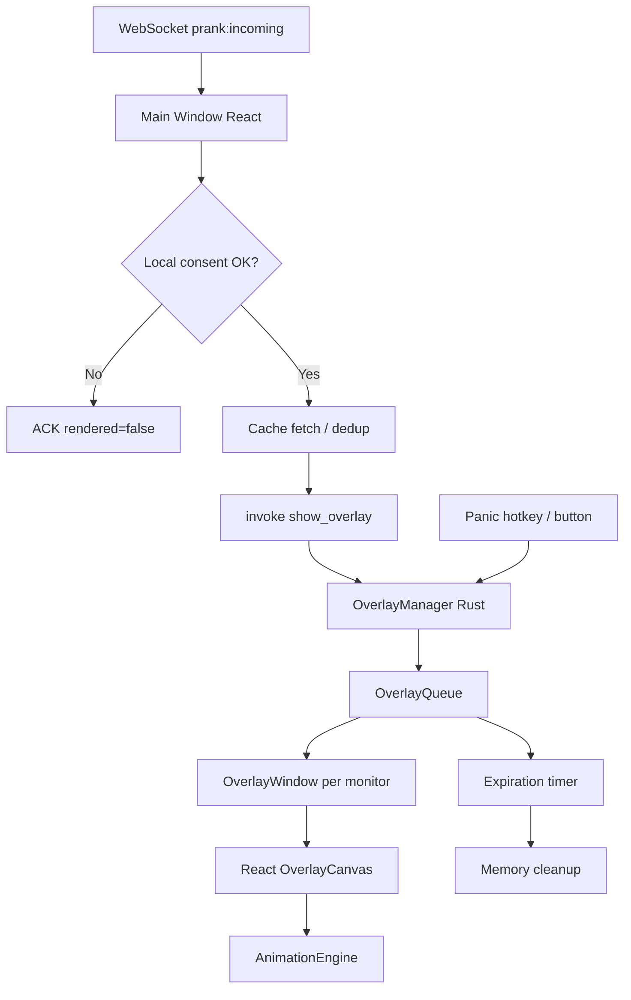

---

## 3. Overlay Window System

### 3.1 Window Topology

| Property | Value |
|----------|-------|
| Count | **One `WebviewWindow` per active monitor** |
| Label | `overlay-{monitor_id}` (e.g. `overlay-0`, `overlay-1`) |
| Parent | None (top-level) |
| URL | `/overlay.html` (dedicated Vite entry) |

### 3.2 Window Flags (Windows 11)

| Flag | Setting | Purpose |
|------|---------|---------|
| Transparent | `true` | See-through background |
| Decorations | `false` | No title bar |
| Always on top | `true` | Above all apps |
| Skip taskbar | `true` | Hidden from taskbar |
| Focus | `false` on show | Do not steal focus |
| Click-through | `true` (default) | Mouse events pass to apps below |
| Resizable | `false` | Full monitor bounds only |

**Windows API (via Tauri / raw):**

- `WS_EX_LAYERED` + `WS_EX_TRANSPARENT` for click-through
- `HWND_TOPMOST` for z-order
- `SetWindowDisplayAffinity` — *not used* (no capture blocking in MVP)

### 3.3 Window Lifecycle

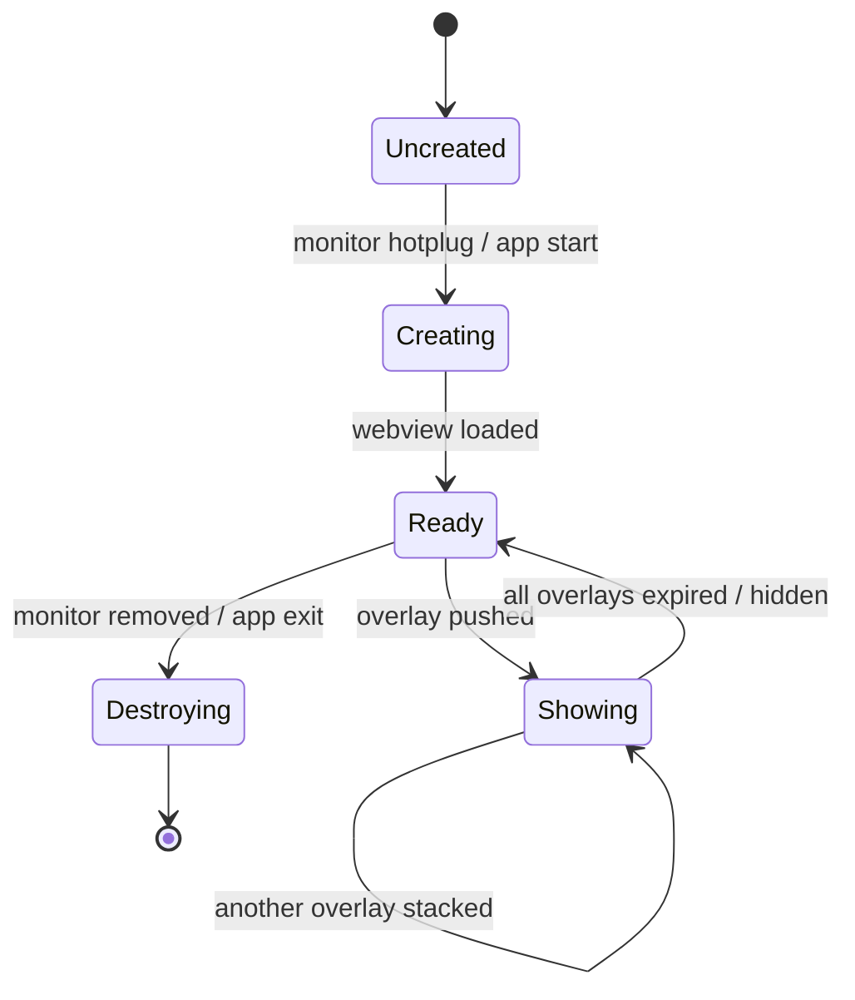

| State | Description |
|-------|-------------|
| `Uncreated` | Monitor exists but no window yet |
| `Creating` | `WebviewWindowBuilder` in progress |
| `Ready` | Window visible but empty (fully transparent) |
| `Showing` | ≥1 active overlay rendered |
| `Destroying` | Teardown on monitor disconnect |

### 3.4 Lifecycle Rules

1. **Lazy create** — overlay windows created on first prank targeting that monitor, or on app start if user enables "preload overlays".
2. **Persistent while monitors exist** — windows stay `Ready` between pranks (avoid create/destroy churn).
3. **Position & size** — match monitor bounds from `monitor.rs` every show and on `display_change` event.
4. **DPI aware** — use physical pixels from Tauri monitor API; React uses `devicePixelRatio`.

### 3.5 Click-Through Toggle

| Mode | When |
|------|------|
| Click-through ON | Default — victim can interact with apps below |
| Click-through OFF | Reserved for future interactive overlays / debug |

Toggle via Tauri command `set_overlay_interactive(monitor_id, bool)` — **future**.

---

## 4. Overlay Queue

### 4.1 Responsibilities

The **OverlayQueue** (`queue.rs`) manages all pending and active overlays per monitor and globally.

```rust
pub struct OverlayQueue {
    items: VecDeque<QueuedOverlay>,
    active: HashMap<OverlayId, ActiveOverlay>,
    config: QueueConfig,
}
```

### 4.2 Queue Entry

```rust
pub struct QueuedOverlay {
    pub id: OverlayId,
    pub payload: OverlayPayload,
    pub priority: QueuePriority,
    pub enqueued_at: Instant,
    pub expires_at: Instant,
    pub monitor_id: MonitorId,
    pub z_index: u32,
}
```

### 4.3 Priority System

| Priority | Value | Source |
|----------|-------|--------|
| `Critical` | 100 | System / panic recovery notices |
| `High` | 75 | Direct (targeted) pranks |
| `Normal` | 50 | Room broadcast pranks |
| `Low` | 25 | Queued backlog when at capacity |

**Ordering:** higher priority first → earlier `enqueued_at` first.

### 4.4 Stacking Rules

| Rule | Value |
|------|-------|
| Max simultaneous overlays (global) | **8** |
| Max per monitor | **4** |
| Z-index base | `1000` |
| Z-index step | `+10` per overlay on same monitor |
| Sound + visual | Same overlay entry; audio tied to visual `OverlayId` |
| Audio-only | No z-index competition; obeys max **2** concurrent sounds |

When at capacity:

1. Drop incoming **Low** priority pranks (ACK `rendered=false`, reason `QUEUE_FULL`).
2. Evict oldest **Low** active overlay if incoming is **Normal** or higher.
3. Never evict **High** or **Critical** without user panic.

### 4.5 Expiration Handling

```
expires_at = received_at + duration_ms + grace_period(500ms)
```

| Event | Action |
|-------|--------|
| Timer fires | Transition overlay `Active → Expiring` |
| Expiring | Play out animation (default 300ms fade out) |
| Animation done | Remove from `active`, emit `overlay:removed` IPC |
| Past hard cap | Force remove at `duration_ms + 5s` regardless of animation |

Background task: `queue.rs` runs a 16ms tick (aligned to frame budget) checking expirations.

### 4.6 Memory Cleanup Strategy

| Asset | Cleanup trigger |
|-------|-----------------|
| DOM nodes | React unmount on overlay remove |
| `<video>` / `<audio>` | `pause()` + `src=''` + `load()` |
| Object URLs | `URL.revokeObjectURL` on remove |
| Rust queue entries | Drop after removal event ACK from webview |
| GPU textures | WebView2 GC; no manual GL in MVP |

**Post-panic:** clear queue + active maps + signal all webviews `clear_all`.

---

## 5. Overlay Renderer

### 5.1 Architecture

```
OverlayCanvas (React root per overlay window)
├── OverlayStack (z-ordered list)
│   ├── ImageOverlay
│   ├── GifOverlay
│   ├── VideoOverlay
│   ├── TextOverlay
│   └── (AudioOverlay — no visual node; AudioManager handles)
└── AudioManager (Web Audio API + <audio> fallback)
```

IPC: webview listens to Tauri events `overlay:show`, `overlay:hide`, `overlay:clear`.

### 5.2 Shared Overlay Props

```typescript
interface OverlayRenderProps {
  id: string;
  position: { x: number; y: number }; // 0–1 normalized monitor space
  scale: number;
  opacity: number;
  animation: AnimationKind;
  onReady: () => void;
  onError: (err: string) => void;
  onComplete: () => void;
}
```

### 5.3 ImageOverlay

| Stage | Behavior |
|-------|----------|
| Loading | Skeleton pulse at target position (optional; default invisible) |
| Load | `new Image()` → `src` from cache path or URL |
| Ready | `onReady` → start animation + duration timer |
| Error | Show nothing; `onError`; ACK failed |
| Render | `` with `object-fit: contain`, hardware-accelerated |

**Preload:** cache layer returns local `file://` or asset protocol path before show.

### 5.4 GifOverlay

| Approach | MVP |
|----------|-----|
| Rendering | `` — browser decodes frames |
| Loop | Respect GIF loop count; if infinite, loop until `duration_ms` |
| Fallback | If GIF > 15MB or decode fails → static first frame or skip |

### 5.5 VideoOverlay

| Stage | Behavior |
|-------|----------|
| Loading | Buffer until `canplaythrough` or 3s timeout |
| Playback | `autoplay muted=false` with volume from config |
| Loop | No loop — stop at `duration_ms` or video end (whichever first) |
| Error | `onError`; skip visual; still ACK |

```html
<video playsInline autoPlay />
```

### 5.6 AudioOverlay

| Stage | Behavior |
|-------|----------|
| Manager | `AudioManager` singleton per overlay window |
| Playback | Web Audio API `AudioBuffer` preferred; `<audio>` fallback |
| Visual | None — optional tiny mute indicator disabled in MVP |
| Stop | On expiry, panic, or new audio if at concurrent limit |

### 5.7 TextOverlay

| Property | Source |
|----------|--------|
| Content | `text_content` from prank payload |
| Style | Large bold white text, dark stroke shadow (readability) |
| Font | Inter (bundled) |
| Max length | 500 chars (server validated) |
| Wrapping | `max-width: 80vw` centered at position |

### 5.8 Loading & Error Summary

| State | UI | IPC |
|-------|-----|-----|
| `Loading` | Transparent / no flash | — |
| `Ready` | Animation in | `overlay:ready { id }` |
| `Playing` | Visible | — |
| `Error` | Nothing shown | `overlay:error { id, reason }` |
| `Done` | Animation out | `overlay:complete { id }` |

### 5.9 Asset Caching Integration

Before render, `manager.rs` calls `cache::resolve(media_ref)`:

1. Hit local SQLite + file → return path immediately  
2. Miss → HTTP download (authenticated) → store → return path  
3. Duplicate SHA256 → symlink/reuse existing file  

---

## 6. Animation Engine

### 6.1 Supported Animations

| ID | Enter | Exit (default) |
|----|-------|----------------|
| `fade` | opacity 0→1 | opacity 1→0 |
| `zoom` | scale 0.5→target | scale target→0.5 |
| `bounce` | spring overshoot scale | ease out |
| `slide_left` | translateX +100%→0 | reverse |
| `slide_right` | translateX -100%→0 | reverse |
| `slide_up` | translateY +100%→0 | reverse |
| `slide_down` | translateY -100%→0 | reverse |
| `shake` | horizontal oscillation ±8px | fade out |
| `pop` | scale 0→1.1→1.0 | scale 1→0 |
| `none` | instant | instant |

### 6.2 Timing Model

```typescript
interface AnimationSpec {
  kind: AnimationKind;
  enter_duration_ms: number;  // default 400
  exit_duration_ms: number;   // default 300
  easing_enter: string;       // default 'cubic-bezier(0.34, 1.56, 0.64, 1)' for bounce/pop
  easing_exit: string;        // default 'ease-in'
  hold_ms: number;            // duration_ms - enter - exit
}
```

**Timeline:**

```
|-- enter --|-- hold (content visible) --|-- exit --|
0          enter_duration              expires_at
```

### 6.3 Implementation

| Layer | Responsibility |
|-------|----------------|
| `animation.rs` | Rust: validate animation enum, compute timing |
| `AnimationEngine.tsx` | React: CSS `@keyframes` + `requestAnimationFrame` for shake |
| GPU path | `transform` + `opacity` only (compositor-friendly) |

**60 FPS rule:** no layout-thrashing properties (`width`, `height`, `top`, `left`) during animation — use `transform: translate() scale()`.

### 6.4 Transition Architecture

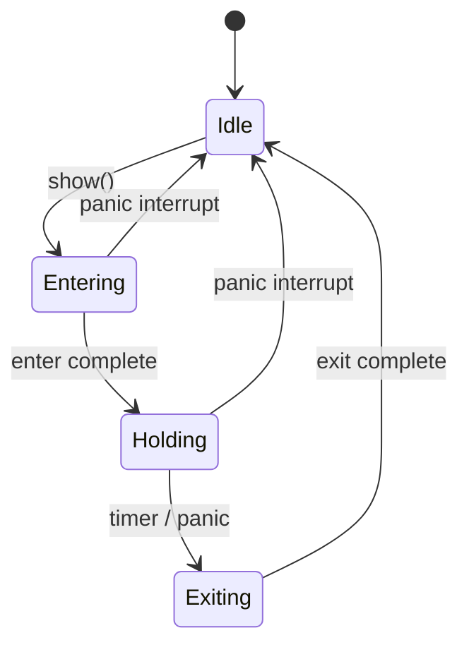

Panic **skips** exit animation — instant `opacity: 0` + unmount.

---

## 7. Multi-Monitor Support

### 7.1 Monitor Detection

**Module:** `monitor.rs`

```rust
pub struct MonitorInfo {
    pub id: MonitorId,           // stable index 0..n-1
    pub name: String,
    pub x: i32,
    pub y: i32,
    pub width: u32,
    pub height: u32,
    pub scale_factor: f64,
    pub is_primary: bool,
}
```

**Source:** Tauri `Monitor` API + `EnumDisplayMonitors` validation on Windows.

### 7.2 Monitor IDs

| ID | Meaning |
|----|---------|
| `0..N-1` | Enumerated at detection time |
| `primary` | Resolved to primary monitor ID at dispatch |
| `null` | Broadcast — show on **all** monitors |

### 7.3 Overlay Targeting

```rust
pub enum OverlayTarget {
    Monitor(MonitorId),
    Primary,
    All,
}
```

Dispatch in `manager.rs`:

- `Monitor(n)` → single queue on `overlay-n`
- `Primary` → resolve → single queue
- `All` → clone payload per monitor (unique `OverlayId` each)

### 7.4 Hotplug Handling

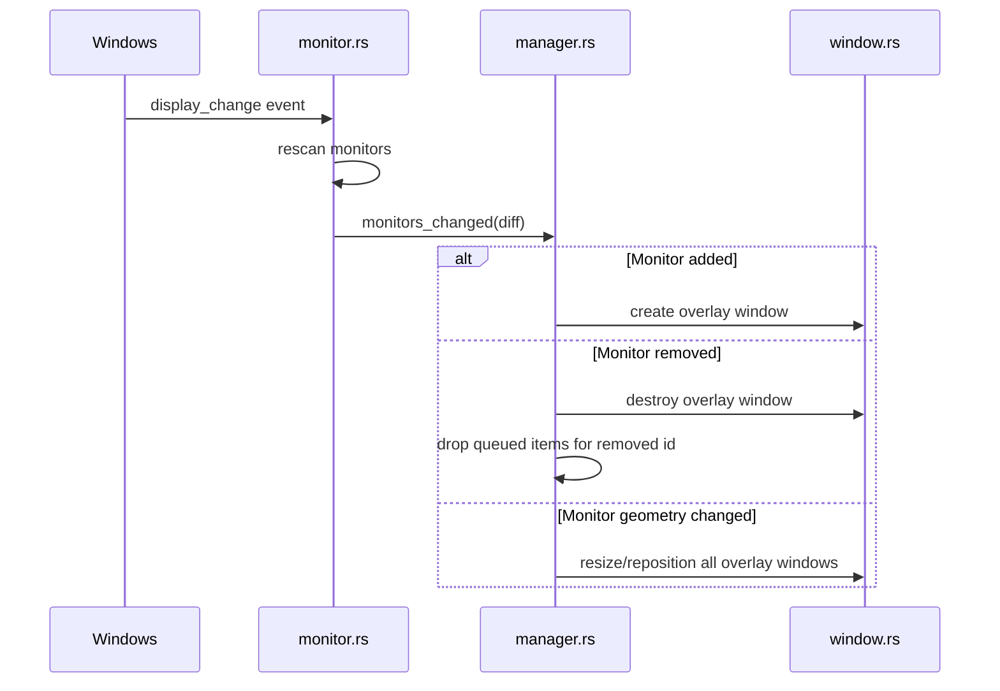

Debounce hotplug events: **250ms** to avoid thrashing during dock/undock.

### 7.5 Virtual Placement Mode

> Overlays are positioned on a **virtual canvas** that mirrors the target's monitor topology. Senders never see the target's screen — only geometry metadata from [GET /users/{id}/monitors](../API.md).

#### Design goals

- Feel like **Discord image sharing** + **Figma canvas placement** + **Stream Deck drag-and-drop**
- Resolution-independent: normalized coordinates survive 1080p → 4K changes
- Support single-monitor, per-monitor, and cross-monitor targeting

#### `OverlayTargetPosition` model

```rust
pub struct OverlayTargetPosition {
    /// 0-based index from monitor layout sync
    pub monitor_index: u32,
    /// Normalized horizontal position (0.0 = left edge, 1.0 = right edge)
    pub x: f32,
    /// Normalized vertical position (0.0 = top edge, 1.0 = bottom edge)
    pub y: f32,
    /// Optional normalized width/height for resizable overlays (0.0–1.0 of monitor)
    pub width: Option<f32>,
    pub height: Option<f32>,
    /// Placement preset when not using exact drag coordinates
    pub preset: PlacementPreset,
}

pub enum PlacementPreset {
    Exact,           // use x, y from canvas drag
    Center,          // x=0.5, y=0.5
    Random,          // random x,y within safe margins
    TopLeft,
    TopRight,
    BottomLeft,
    BottomRight,
}
```

#### Coordinate normalization

All placement values use **normalized coordinates** `0.0 → 1.0`:

| Axis | 0.0 | 0.5 | 1.0 |
|------|-----|-----|-----|
| `x` | Left edge | Horizontal center | Right edge |
| `y` | Top edge | Vertical center | Bottom edge |

**Example — user drags GIF to center of Monitor 1:**

```
Canvas position:  x = 0.50, y = 0.50, monitor_index = 0
```

**Rendering on receiver (2560×1440 primary):**

```rust
let m = &layout.monitors[monitor_index];
let pixel_x = m.x + (position.x * m.width as f32) as i32;
let pixel_y = m.y + (position.y * m.height as f32) as i32;
// pixel_x = 0 + 0.5 * 2560 = 1280
// pixel_y = 0 + 0.5 * 1440 = 720  → center regardless of resolution
```

On a 1920×1080 monitor the same `0.5, 0.5` maps to `(960, 540)`.

#### Coordinate transformation pipeline

```
1. Sender: drag on MonitorCanvas → OverlayTargetPosition (normalized)
2. Prank config JSON stores position in OverlayConfig
3. Receiver: load own monitor layout (authoritative for pixels)
4. Transform: normalized → virtual desktop pixels
5. Overlay window positioned at (pixel_x, pixel_y) on correct monitor
```

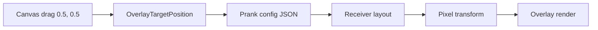

#### Multi-monitor placement

| Mode | `monitor_index` | Behavior |
|------|-----------------|----------|
| **Per-monitor** | `0`, `1`, … | Overlay on single display |
| **Cross-monitor** | Edge coords spanning monitors | Position near bezel; clamp to target monitor |
| **Broadcast** | `null` / all | Clone overlay to every monitor at same normalized position |

#### Rendering example (React overlay window)

```tsx
// Normalized position from prank config
const { monitor_index, x, y } = prank.config.position;
const monitor = layout.monitors[monitor_index];

const left = monitor.x + x * monitor.width;
const top = monitor.y + y * monitor.height;

return (
  
);
```

#### DPI scaling

`scale_factor` from monitor metadata is used for **canvas preview sizing** only. Normalized coordinates are resolution-independent; physical pixel math uses logical width/height from the layout sync.

---

---

## 8. Performance Targets

### 8.1 Frame Rate

| Target | Requirement |
|--------|-------------|
| Minimum | **60 FPS** during animations |
| Preferred | **144 FPS** on high-refresh displays |
| Idle | **0 FPS** — no `requestAnimationFrame` loop when queue empty |

### 8.2 Resource Budgets

| Resource | Budget (MVP) |
|----------|--------------|
| CPU (idle, no overlays) | < 1% |
| CPU (4 active overlays) | < 8% on mid-range CPU |
| GPU | Compositor only; no custom shaders |
| RAM (overlay engine) | < 150 MB incl. cache metadata |
| RAM (cache on disk) | User setting, default **500 MB** |
| Webview count | 1 main + N monitors (typically 1–3) |

### 8.3 Per-Overlay Budgets

| Content | Max decode time | Max display size |
|---------|-----------------|------------------|
| Image | 500ms | 4096×4096 px |
| GIF | 1000ms | 15 MB |
| Video | 3000ms to first frame | 1080p |
| Audio | 500ms | — |
| Text | instant | 500 chars |

### 8.4 Monitoring

Rust telemetry (debug builds):

- Frame drop counter via IPC heartbeat every 1s
- Queue depth gauge
- Cache hit ratio

---

## 9. Panic System

### 9.1 Triggers

| Trigger | Latency target |
|---------|----------------|
| Sidebar **Panic** button | < 50ms |
| Global hotkey (default `Ctrl+Shift+Escape`) | < 30ms |
| `POST /consent/pause` (async) | < 500ms server |
| Consent revoke while overlays active | < 50ms local |

### 9.2 Architecture

**Module:** `panic.rs`

```rust
pub struct PanicController {
    is_active: AtomicBool,
    hotkey_registered: AtomicBool,
}

impl PanicController {
    pub fn trigger(&self, manager: &OverlayManager) -> Result<(), PanicError>;
    pub fn register_hotkey(&self, app: &AppHandle) -> Result<(), PanicError>;
}
```

### 9.3 Panic Sequence (local)

```
1. panic.is_active = true
2. manager.clear_all_queues()
3. For each overlay window:
     emit("overlay:clear")        // React instant unmount
4. audio_manager.stop_all()
5. consent_store.pause()         // IPC to main window
6. POST /v1/consent/pause        // async, non-blocking
7. WS consent:sync               // notify server
```

### 9.4 Panic Mode Lifecycle

See [§13.3 Panic Mode State Machine](#133-panic-mode-lifecycle).

**Recovery:** user clicks "Resume Receiving" in Settings → `panic.is_active = false` → normal queue resumes (does not replay hidden pranks).

---

## 10. Media Cache

### 10.1 Storage Layout

```
%APPDATA%/ScreenRaid/
├── screenraid-client.db     # SQLite metadata
└── cache/
    └── {sha256_prefix}/
        └── {media_id}.{ext}
```

### 10.2 Schema (client SQLite)

```sql
CREATE TABLE cached_media (
    media_id    TEXT PRIMARY KEY,
    url         TEXT NOT NULL,
    file_path   TEXT NOT NULL,
    mime_type   TEXT NOT NULL,
    size_bytes  INTEGER NOT NULL,
    hash_sha256 TEXT NOT NULL,
    cached_at   TEXT NOT NULL,
    last_used_at TEXT NOT NULL,
    expires_at  TEXT          -- optional TTL
);
```

### 10.3 Operations (`cache.rs`)

| Function | Description |
|----------|-------------|
| `resolve(media)` | Return local path; download on miss |
| `touch(media_id)` | Update `last_used_at` |
| `evict_lru()` | Called when over `cache_limit_mb` |
| `purge_expired()` | Daily job; default 30-day unused |
| `find_by_hash(sha256)` | Duplicate detection |

### 10.4 Duplicate Detection

If `hash_sha256` already exists:

- Reuse file on disk
- Insert new `media_id` row pointing to same path (refcount via query count)
- Skip re-download

### 10.5 Automatic Cleanup

| Policy | Default |
|--------|---------|
| Max cache size | 500 MB |
| LRU eviction | When > 90% full, evict to 70% |
| Expire unused | 30 days since `last_used_at` |
| On panic | **No** cache purge (only active overlays) |

---

## 11. Overlay Security

### 11.1 Hard Limits

| Limit | Value |
|-------|-------|
| Max overlay duration | **60 000 ms** (60s) |
| Max image size | 10 MB |
| Max GIF size | 15 MB |
| Max video size | 50 MB |
| Max audio size | 10 MB |
| Max text length | 500 chars |
| Max volume | **1.0** (clamped client-side) |
| Max concurrent overlays | 8 global / 4 per monitor |
| Max pranks / minute | 30 per room (server) |

### 11.2 Allowed Formats

Validated server-side (`screenraid-validation`) and re-checked client-side:

| Type | MIME |
|------|------|
| Image | `image/png`, `image/jpeg`, `image/webp` |
| GIF | `image/gif` |
| Video | `video/mp4`, `video/webm` |
| Audio | `audio/mpeg`, `audio/wav`, `audio/ogg` |

Magic-byte sniff required — extension alone is insufficient.

### 11.3 Anti-Spam Protections

| Layer | Mechanism |
|-------|-----------|
| Server | Rate limits, consent checks, role checks |
| Client queue | Max capacity + priority eviction |
| Client cooldown | Min **2s** between full-screen visual overlays from same sender |
| Duplicate prank | Same `prank_id` ignored (idempotent) |

### 11.4 Consent Gate (client)

Overlays **never** enter queue if:

- `global_consent == false`
- `is_paused == true`
- Per-room consent denied for prank's room

Still send `prank:ack { rendered: false }`.

---

## 12. Rust Module Structure

```
client/src-tauri/src/overlay/
├── mod.rs           # Public API, re-exports
├── models.rs        # OverlayPayload, OverlayId, MonitorId, enums
├── monitor.rs       # Detection, hotplug, geometry
├── window.rs        # WebviewWindow create/destroy/position
├── queue.rs         # Priority queue, expiration, capacity
├── manager.rs       # Orchestrator: show/hide/clear, IPC bridge
├── renderer.rs      # IPC protocol to React; render commands
├── animation.rs     # Animation spec validation, timing
├── cache.rs         # Download, LRU, SHA256 dedup
└── panic.rs         # Hotkey, emergency clear, panic flag
```

### 12.1 Module Responsibilities

| File | Responsibility |
|------|----------------|
| `models.rs` | All shared types; serde for IPC |
| `monitor.rs` | `list_monitors()`, `primary_monitor()`, hotplug listener |
| `window.rs` | `ensure_overlay_window(monitor_id)`, click-through, topmost |
| `queue.rs` | `push`, `pop`, `expire_tick`, capacity enforcement |
| `manager.rs` | High-level `show_overlay`, coordinates cache→queue→window |
| `renderer.rs` | Emits `overlay:show` events with resolved asset paths |
| `animation.rs` | Maps `Animation` enum → `AnimationSpec` |
| `cache.rs` | Filesystem + SQLite cache |
| `panic.rs` | `panic_hide_all()`, global shortcut registration |

### 12.2 Tauri Commands (IPC)

| Command | Args | Returns |
|---------|------|---------|
| `show_overlay` | `OverlayPayload` | `OverlayId` |
| `hide_overlay` | `id` | `()` |
| `panic_hide_all` | — | `()` |
| `get_active_overlays` | — | `Vec<OverlayState>` |
| `list_monitors` | — | `Vec<MonitorInfo>` |
| `cache_media` | `url, hash` | `PathBuf` |
| `get_cache_size` | — | `u64` |
| `clear_cache` | — | `CleanupReport` |

### 12.3 React Overlay Entry

```
client/
├── overlay.html
└── src/overlay/
    ├── main.tsx
    ├── OverlayCanvas.tsx
    ├── AnimationEngine.tsx
    ├── AudioManager.ts
    └── renderers/
        ├── ImageOverlay.tsx
        ├── GifOverlay.tsx
        ├── VideoOverlay.tsx
        └── TextOverlay.tsx
```

---

## 13. State Machines

### 13.1 Overlay Lifecycle

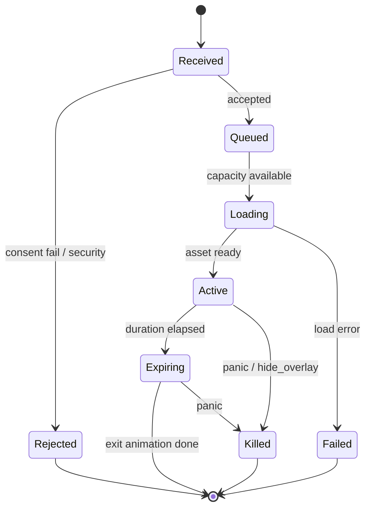

### 13.2 Queue Lifecycle

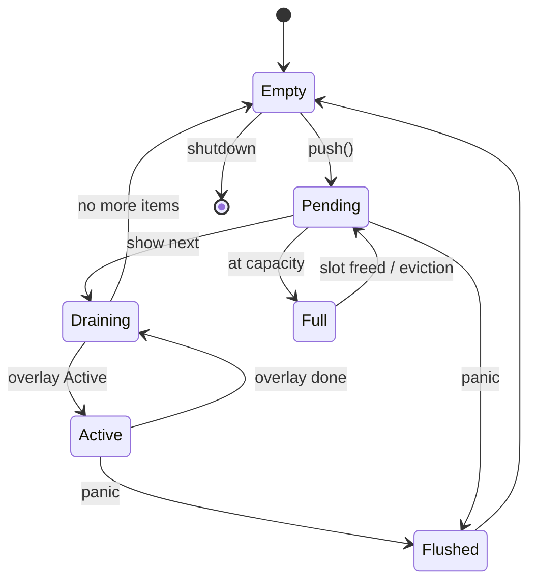

### 13.3 Panic Mode Lifecycle

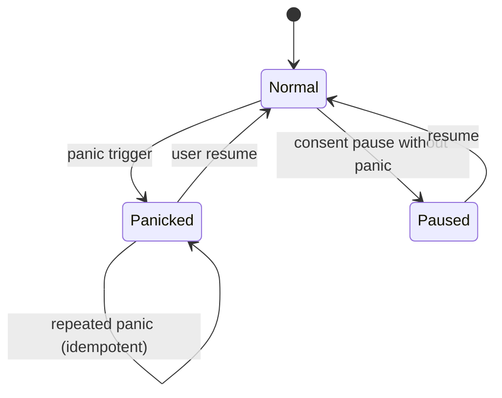

| State | Overlays | Queue | Audio |
|-------|----------|-------|-------|
| `Normal` | Allowed | Accepts | Allowed |
| `Panicked` | All killed | Cleared | Stopped |
| `Paused` | All killed | Rejects new | Stopped |

---

## 14. Sequence Diagrams

### 14.1 Receiving a Prank

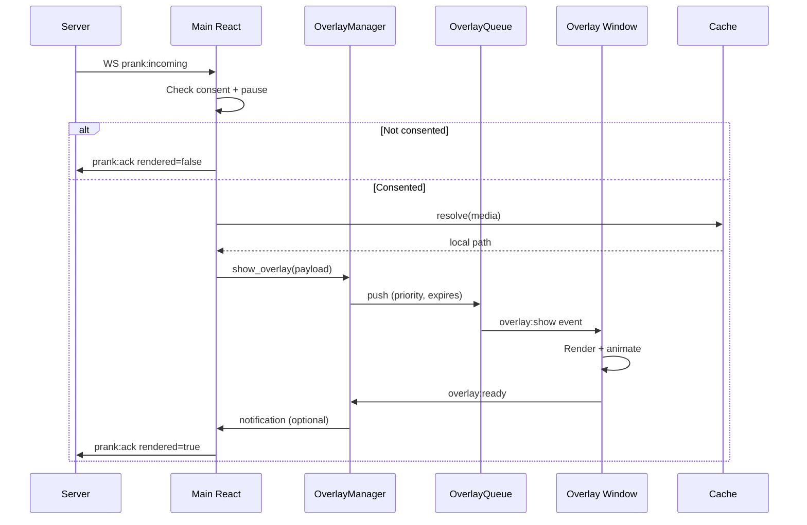

### 14.2 Loading Media

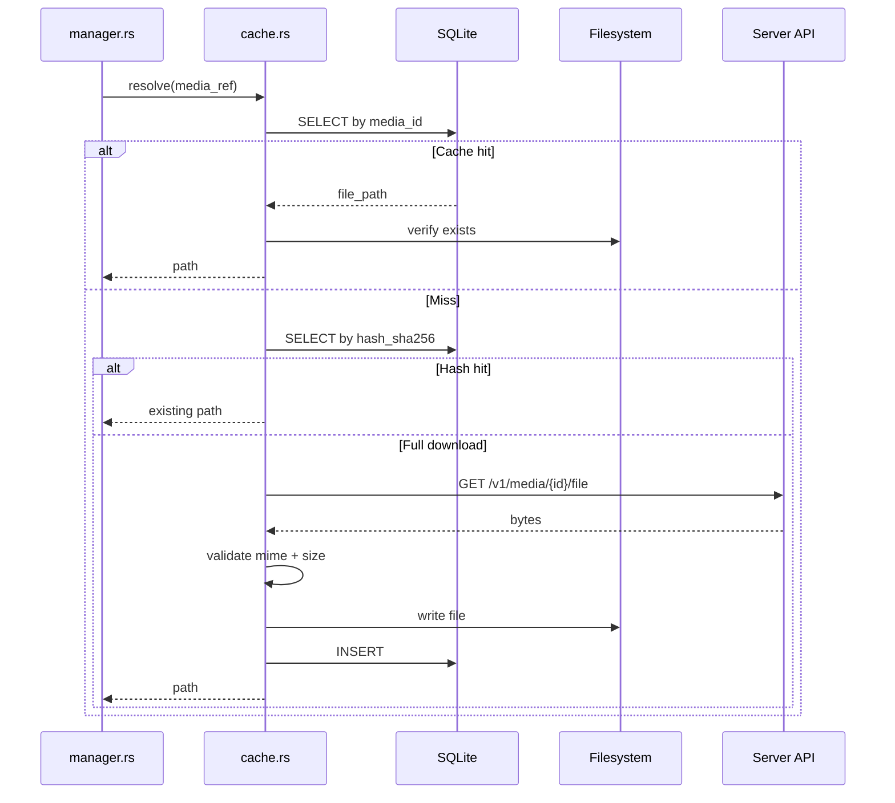

### 14.3 Rendering Overlay

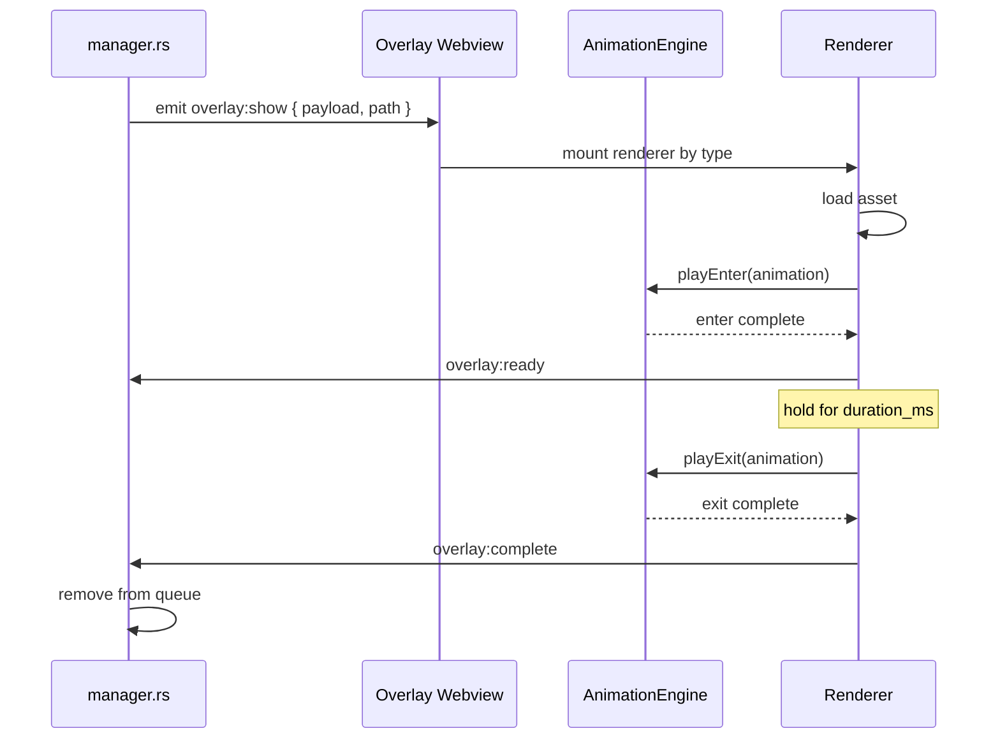

### 14.4 Expiration Cleanup

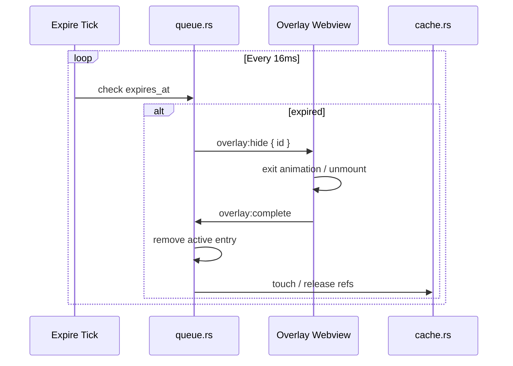

---

## 15. Future Features

Architecture reserves extension points without breaking MVP modules.

### 15.1 Screen Effects

| Feature | Extension |
|---------|-----------|
| Full-screen tint / flash | `CustomEffectOverlay` in renderer |
| Particle systems | WebGL layer in overlay webview |
| Module hook | `renderer.rs` → `EffectPlugin` trait |

### 15.2 Webcam Overlays

| Concern | Approach |
|---------|----------|
| Capture | `navigator.mediaDevices` in dedicated overlay |
| Privacy | Requires separate explicit consent flag |
| Click-through | Disabled for webcam preview config window only |

### 15.3 Interactive Overlays

| Concern | Approach |
|---------|----------|
| Click-through off | `window.rs::set_click_through(false)` |
| Input | Focus overlay window temporarily |
| Use case | Mini-games, "click to dismiss" pranks |

### 15.4 Plugin System

```rust
pub trait OverlayPlugin: Send + Sync {
    fn name(&self) -> &str;
    fn content_types(&self) -> &[OverlayType];
    fn render_spec(&self, payload: &OverlayPayload) -> RenderSpec;
}
```

Plugins registered at startup in `manager.rs`:

```rust
manager.register_plugin(Box::new(ScreenFlashPlugin));
```

React side: dynamic `import()` of plugin bundle from `plugins/{id}/renderer.js`.

### 15.5 Reserved Types

```rust
pub enum OverlayType {
    Image, Gif, Video, Text, Sound,
    #[serde(other)]
    Custom(String),  // future
}
```

---

## Appendix A — IPC Event Catalog

| Event | Direction | Payload |
|-------|-----------|---------|
| `overlay:show` | Rust → Webview | `{ id, type, path, config, animation }` |
| `overlay:hide` | Rust → Webview | `{ id }` |
| `overlay:clear` | Rust → Webview | `{}` |
| `overlay:ready` | Webview → Rust | `{ id }` |
| `overlay:complete` | Webview → Rust | `{ id }` |
| `overlay:error` | Webview → Rust | `{ id, reason }` |
| `monitors:changed` | Rust → Main | `{ monitors: MonitorInfo[] }` |

---

## Appendix B — Implementation Phases (cross-ref)

| Phase | Overlay deliverable |
|-------|---------------------|
| Phase 6a | `monitor.rs` + `window.rs` — empty transparent windows |
| Phase 6b | `queue.rs` + `manager.rs` — image + text |
| Phase 6c | GIF + video + audio renderers |
| Phase 6d | `animation.rs` full + `panic.rs` hotkey |
| Phase 6e | `cache.rs` complete + performance pass |

---

*Document version: 1.0.0 — ScreenRaid Overlay Engine*
