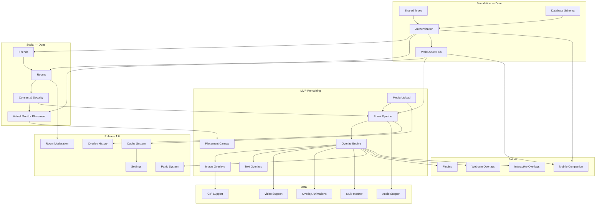

# ScreenRaid — Product Roadmap

> Milestone-based development plan with complexity estimates and dependency graph.

**Complexity scale:** XS (&lt;4h) · S (4–8h) · M (1–2d) · L (3–5d) · XL (1–2w)

---

## MVP

Minimum viable product: consent-based pranks with images and text in private rooms.

**Client split (implemented):** Web dashboard on the server (`http://host:8080/`) for management; Tauri **receiver** on each PC for overlays only.

| Module | Complexity | Status | Notes |
|--------|------------|--------|-------|
| **Authentication** | M | ✅ Done | JWT + refresh, register/login, client token refresh |
| **Friends** | M | ✅ Done | Requests, accept/decline, friend list |
| **Rooms** | M | ✅ Done | Create/join/leave, members, roles |
| **Consent & Security** | M | ✅ Done | Grant/revoke/pause, rate limits, WS sync, panic hotkey |
| **WebSocket** | M | ✅ Done | Hub, presence, room/friend events, heartbeat |
| **Media Upload** | L | ✅ Done | Server storage, validation, client library UI |
| **Virtual Monitor Placement** | L | ✅ Done | Monitor topology sync, placement canvas, normalized coords |
| **Prank Pipeline** | L | ✅ Done | Send/receive, consent gate, delivery ack |
| **Image Overlays** | L | ✅ Done | Transparent window, image render, fade/zoom/bounce |
| **Text Overlays** | M | ✅ Done | Styled text card, normalized position |
| **Integration & QA** | M | 🔄 In progress | CI workflow, server integration tests; manual E2E pending |

**MVP exit criteria:** Two users in a room can send a consent-checked image or text overlay that appears at a **visually placed position** on the receiver's virtual monitor layout — without screen sharing.

### Virtual Monitor Placement — MVP Priority: HIGH

| Capability | Complexity | Status |
|------------|------------|--------|
| Client monitor enumeration | M | ✅ |
| `PUT /users/me/monitors` sync | S | ✅ |
| `GET /users/{id}/monitors` for room members | S | ✅ |
| WS `monitor:update` / `monitor:changed` | M | ✅ |
| Visual Placement Canvas in Room | L | ✅ |
| Normalized coordinate prank config | M | ✅ |

**Why MVP:** Enables precise prank positioning (Figma-style canvas) without desktop streaming or screen capture — core privacy promise.

---

## Beta

Richer media and polish before public beta.

| Module | Complexity | Depends on |
|--------|------------|------------|
| **GIF support** | M | Image Overlays, Media Upload |
| **Video support** | L | Overlay Engine, Media Upload |
| **Audio support** | M | Prank Pipeline, client audio player |
| **Overlay animations** | M | Overlay Engine |
| **Multi-monitor support** | L | Overlay Engine |

---

## Release 1.0

Production-hardening and moderation.

| Module | Complexity | Depends on |
|--------|------------|------------|
| **Panic system** | S | Overlay Engine (client hotkey ✅, server kill-switch 🔲) |
| **Cache system** | M | Media Upload, client SQLite cache |
| **Overlay history** | M | Prank Pipeline, DATABASE |
| **Room moderation** | M | Rooms, roles, audit log |
| **Settings** | S | Client settings store (partial ✅) |

---

## Future

| Module | Complexity | Depends on |
|--------|------------|------------|
| **Plugins** | XL | Overlay Engine, stable API |
| **Webcam overlays** | L | Overlay Engine, media capture |
| **Interactive overlays** | XL | Overlay Engine, input routing |
| **Mobile companion app** | XL | REST/WS API, push notifications |

---

## Dependency Graph



### Critical path (MVP)

```
Authentication → Friends → Rooms → Consent
       ↓
WebSocket ──────────────────────────────┐
       ↓                                │
Media Upload → Prank Pipeline ← Consent ┘
       ↓              ↑
Virtual Monitor Placement → Placement Canvas
       ↓
Overlay Engine → Image Overlays + Text Overlays
```

---

## Phase alignment

| Phase | Roadmap items | Doc reference |
|-------|---------------|---------------|
| 0 | Foundation, monorepo, design system | `ARCHITECTURE.md` |
| 1 | Authentication | `API.md` |
| 2 | Friends, Rooms, WebSocket | `WEBSOCKET.md` |
| 3 | Consent & Security | `SECURITY.md` |
| 4 | Media Upload | `API.md`, `SECURITY.md` |
| 5 | Prank Pipeline | `WEBSOCKET.md` |
| 6 | Overlay Engine | `OVERLAY_ENGINE.md` |
| 7–8 | Beta + 1.0 features | `DEPLOYMENT.md`, `TESTING.md` |

See [TASKS.md](./TASKS.md) for actionable MVP task breakdown.
