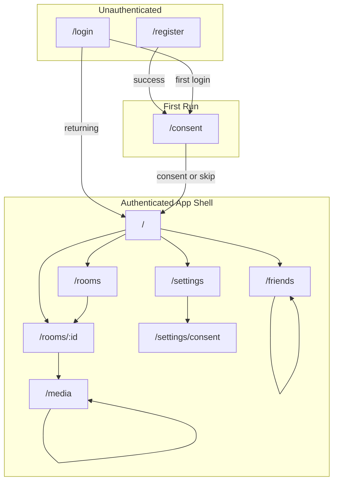
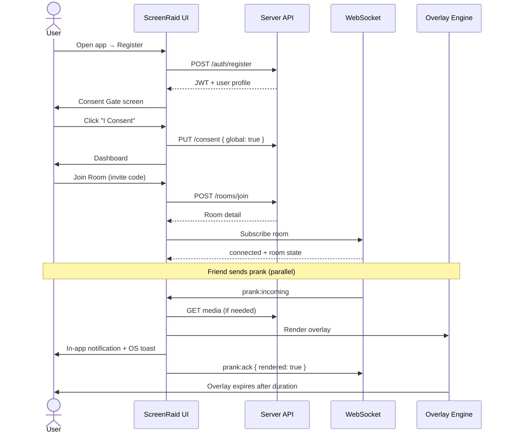

# ScreenRaid — Desktop UI Wireframes

> **Design system:** HomeBoard Anthracite Orange  
> Flat admin-panel UI. No glassmorphism. No neon.  
> Canonical tokens: [DESIGN_SYSTEM.md](./DESIGN_SYSTEM.md)

**Scope:** Main Tauri window only (auth, dashboard, rooms, settings). Overlay windows are media-only and out of scope here.

**Breakpoints:**
| Name | Width | Notes |
|------|-------|-------|
| Desktop | ≥ 1200px | Full sidebar + multi-column layouts |
| Narrow | 900px – 1199px | Collapsed sidebar icon rail, stacked columns |
| Minimum | 900px | Hard floor; horizontal scroll discouraged |

---

## Table of Contents

1. [Global Shell](#1-global-shell)
2. [Login](#2-login)
3. [Register](#3-register)
4. [Dashboard](#4-dashboard)
5. [Friends](#5-friends)
6. [Rooms](#6-rooms)
7. [Room Details](#7-room-details)
8. [Media Library](#8-media-library)
9. [Upload Modal](#9-upload-modal)
10. [Settings](#10-settings)
11. [Consent Settings](#11-consent-settings)
12. [Notifications](#12-notifications)
13. [Navigation Flows](#13-navigation-flows)
14. [User Journeys](#14-user-journeys)
15. [Responsive Behavior](#15-responsive-behavior)

---

## 1. Global Shell

Authenticated screens share this layout. Auth screens (Login, Register) and the first-run Consent gate omit the sidebar.

### ASCII — App Shell (≥ 1200px)

```
┌──────────────────────────────────────────────────────────────────────────────┐
│ TitleBar  #232323  border-b #3a3a3a                              [_ □ ✕]   │
│  [≡]  ScreenRaid                                    ● Connected   🔔 (3)    │
├──────────────┬───────────────────────────────────────────────────────────────┤
│  Sidebar     │  Main Content  #1a1a1a  p-24px                                 │
│  #232323     │                                                                │
│  w-240px     │  ┌─ PageHeader ──────────────────────────────────────────┐  │
│              │  │  Display title (28px)          [Secondary] [Primary CTA]│  │
│  [Logo]      │  └──────────────────────────────────────────────────────────┘  │
│              │                                                                │
│  ● Dashboard │  ┌──────────────┐  ┌──────────────┐  ┌──────────────┐       │
│    Rooms     │  │ Card #2f2f2f │  │ Card #2f2f2f │  │ Card #2f2f2f │       │
│    Friends   │  │ rounded-16px │  │ rounded-16px │  │ rounded-16px │       │
│    Media     │  └──────────────┘  └──────────────┘  └──────────────┘       │
│    Settings  │                                                                │
│  ─────────   │  ┌────────────────────────────────────────────────────┐     │
│              │  │ Large Card — table / composer / list                │     │
│  [Avatar]    │  └────────────────────────────────────────────────────┘     │
│  @username   │                                                                │
│  [Panic]     │                                                                │
│  #ef4444     │                                                                │
└──────────────┴───────────────────────────────────────────────────────────────┘
```

### Component Hierarchy — App Shell

```
App
└── MainWindow
    ├── TitleBar
    │   ├── AppLogo (text + icon)
    │   ├── ConnectionStatusBadge
    │   └── NotificationBell → opens Notifications panel
    ├── MainLayout
    │   ├── Sidebar
    │   │   ├── NavGroup
    │   │   │   ├── NavItem (Dashboard)
    │   │   │   ├── NavItem (Rooms)
    │   │   │   ├── NavItem (Friends)
    │   │   │   ├── NavItem (Media)
    │   │   │   └── NavItem (Settings)
    │   │   ├── SidebarFooter
    │   │   │   ├── UserMenu (avatar, username, logout)
    │   │   │   └── PanicButton
    │   │   └── CollapseToggle (narrow breakpoint)
    │   └── Outlet (page content)
    └── ToastContainer
```

### Key Interactions — App Shell

| Action | Behavior |
|--------|----------|
| Nav item click | Route change; active item gets `bg-accent/10` + left orange border |
| Panic button | Immediately hides all overlays; sets consent paused; danger toast |
| Notification bell | Opens Notifications slide-over panel (right) |
| Connection badge | Green dot = WS connected; amber = reconnecting; red = offline |
| User menu | Dropdown: Profile, Consent Settings, Logout |

---

## 2. Login

Centered auth card. No sidebar. Background `#1a1a1a`.

### ASCII Layout

```
┌──────────────────────────────────────────────────────────────────────────────┐
│ TitleBar  #232323                                                            │
├──────────────────────────────────────────────────────────────────────────────┤
│                                                                              │
│                         bg #1a1a1a — full bleed                               │
│                                                                              │
│                    ┌─────────────────────────────────┐                       │
│                    │  Card #2f2f2f  rounded-16px     │                       │
│                    │  border #3a3a3a                 │                       │
│                    │                                 │                       │
│                    │     [ScreenRaid logo]           │                       │
│                    │     Sign in to your account     │  ← display 28px       │
│                    │     Welcome back.               │  ← secondary #b4b4b4  │
│                    │                                 │                       │
│                    │  Email                          │                       │
│                    │  ┌───────────────────────────┐  │                       │
│                    │  │ you@example.com           │  │  Input #2f2f2f        │
│                    │  └───────────────────────────┘  │                       │
│                    │                                 │                       │
│                    │  Password                       │                       │
│                    │  ┌───────────────────────────┐  │                       │
│                    │  │ ••••••••            [👁]  │  │                       │
│                    │  └───────────────────────────┘  │                       │
│                    │                                 │                       │
│                    │  [ ] Remember me    Forgot pwd?  │  link #f97316         │
│                    │                                 │                       │
│                    │  ┌───────────────────────────┐  │                       │
│                    │  │      Sign In  #f97316     │  │  Primary button       │
│                    │  └───────────────────────────┘  │                       │
│                    │                                 │                       │
│                    │  Don't have an account?         │                       │
│                    │  Create one →                   │                       │
│                    └─────────────────────────────────┘                       │
│                              max-w-md (~448px)                               │
└──────────────────────────────────────────────────────────────────────────────┘
```

### Component Hierarchy

```
LoginPage
└── AuthLayout
    └── Card
        ├── AuthHeader
        │   ├── Logo
        │   ├── Title ("Sign in to your account")
        │   └── Subtitle
        ├── LoginForm
        │   ├── Input (email)
        │   ├── Input (password, toggle visibility)
        │   ├── Checkbox (remember me)
        │   ├── Link (forgot password)
        │   ├── Button (primary — Sign In)
        │   └── FormError (inline, danger)
        └── AuthFooter
            └── Link → RegisterPage
```

### Key Interactions

| Action | Behavior |
|--------|----------|
| Sign In | Validate → `POST /auth/login` → store JWT → redirect to Consent gate if first login, else Dashboard |
| Forgot password | Opens placeholder modal or external flow (future) |
| Create one | Navigate to `/register` |
| Invalid credentials | Inline error below form; inputs get danger border |
| Enter key | Submits form when focus in password field |

---

## 3. Register

Same auth layout as Login. Card slightly taller for extra fields.

### ASCII Layout

```
┌──────────────────────────────────────────────────────────────────────────────┐
│ TitleBar  #232323                                                            │
├──────────────────────────────────────────────────────────────────────────────┤
│                                                                              │
│                    ┌─────────────────────────────────┐                       │
│                    │  Card #2f2f2f                   │                       │
│                    │                                 │                       │
│                    │     [ScreenRaid logo]           │                       │
│                    │     Create your account           │                       │
│                    │     Join consent-based pranks.    │                       │
│                    │                                 │                       │
│                    │  Display name                     │                       │
│                    │  ┌───────────────────────────┐  │                       │
│                    │  │ Alex                      │  │                       │
│                    │  └───────────────────────────┘  │                       │
│                    │                                 │                       │
│                    │  Username                       │                       │
│                    │  ┌───────────────────────────┐  │                       │
│                    │  │ alex_raid          ✓ avail│  │  live validation      │
│                    │  └───────────────────────────┘  │                       │
│                    │                                 │                       │
│                    │  Email                          │                       │
│                    │  ┌───────────────────────────┐  │                       │
│                    │  │ alex@example.com          │  │                       │
│                    │  └───────────────────────────┘  │                       │
│                    │                                 │                       │
│                    │  Password                       │                       │
│                    │  ┌───────────────────────────┐  │                       │
│                    │  │ ••••••••                  │  │                       │
│                    │  └───────────────────────────┘  │                       │
│                    │  ████████░░░░  Strong           │  strength meter         │
│                    │                                 │                       │
│                    │  Confirm password               │                       │
│                    │  ┌───────────────────────────┐  │                       │
│                    │  │ ••••••••                  │  │                       │
│                    │  └───────────────────────────┘  │                       │
│                    │                                 │                       │
│                    │  [ ] I agree to Terms & Privacy │                       │
│                    │                                 │                       │
│                    │  ┌───────────────────────────┐  │                       │
│                    │  │    Create Account         │  │  disabled until valid │
│                    │  └───────────────────────────┘  │                       │
│                    │                                 │                       │
│                    │  Already have an account? Sign in│                       │
│                    └─────────────────────────────────┘                       │
└──────────────────────────────────────────────────────────────────────────────┘
```

### Component Hierarchy

```
RegisterPage
└── AuthLayout
    └── Card
        ├── AuthHeader
        ├── RegisterForm
        │   ├── Input (display name)
        │   ├── Input (username) + UsernameAvailabilityHint
        │   ├── Input (email)
        │   ├── Input (password) + PasswordStrengthMeter
        │   ├── Input (confirm password) + MatchIndicator
        │   ├── Checkbox (terms)
        │   ├── Button (primary — Create Account)
        │   └── FormError
        └── AuthFooter
            └── Link → LoginPage
```

### Key Interactions

| Action | Behavior |
|--------|----------|
| Username blur | Debounced `GET /users/check-username` → avail/taken badge |
| Create Account | `POST /auth/register` → auto-login → redirect to Consent gate |
| Terms checkbox | Required; button disabled until checked + valid fields |
| Sign in link | Navigate to `/login` |

---

## 4. Dashboard

Home overview after authentication. Stat cards + activity feeds.

### ASCII Layout

```
┌──────────────────────────────────────────────────────────────────────────────┐
│ TitleBar                                                          🔔 (3)    │
├──────────────┬───────────────────────────────────────────────────────────────┤
│ ● Dashboard  │  Dashboard                                    [Join Room]     │
│   Rooms      │  ─────────────────────────────────────────────────────────    │
│   Friends    │                                                                │
│   Media      │  ┌────────────┐ ┌────────────┐ ┌────────────┐ ┌────────────┐ │
│   Settings   │  │ Active     │ │ Friends    │ │ Pranks     │ │ Consent    │ │
│              │  │ Rooms      │ │ Online     │ │ Today      │ │ Status     │ │
│              │  │    3       │ │    5       │ │   12       │ │ ● Active   │ │
│              │  └────────────┘ └────────────┘ └────────────┘ └────────────┘ │
│              │                                                                │
│  [Avatar]    │  ┌─ Active Rooms ──────────────────────┐ ┌─ Friends Online ─┐ │
│  [Panic]     │  │ ● Game Night        4 members  [→] │ │ ● Alex      idle  │ │
│              │  │ ● Office Chaos      2 members  [→] │ │ ● Sam       online│ │
│              │  │ ○ Study Group       1 member   [→] │ │ ○ Jordan    away  │ │
│              │  │                    [View all →]    │ │    [View all →]   │ │
│              │  └────────────────────────────────────┘ └───────────────────┘ │
│              │                                                                │
│              │  ┌─ Recent Activity ─────────────────────────────────────────┐ │
│              │  │ TIME     EVENT                        ROOM      STATUS   │ │
│              │  │ 2m ago   Alex sent you a GIF          Game Night Delivered│ │
│              │  │ 15m ago  You sent sound to Sam        Office     Acked    │ │
│              │  │ 1h ago   Jordan joined room           Study      —       │ │
│              │  └───────────────────────────────────────────────────────────┘ │
└──────────────┴───────────────────────────────────────────────────────────────┘
```

### Component Hierarchy

```
DashboardPage
└── PageLayout
    ├── PageHeader
    │   ├── Title
    │   └── Button (Join Room — opens invite code modal)
    ├── StatGrid
    │   ├── StatCard (Active Rooms)
    │   ├── StatCard (Friends Online)
    │   ├── StatCard (Pranks Today)
    │   └── StatCard (Consent Status) → links to Consent Settings
    ├── TwoColumnSection
    │   ├── ActiveRoomsCard
    │   │   ├── RoomListItem × n
    │   │   └── Link (View all → Rooms)
    │   └── FriendsOnlineCard
    │       ├── FriendRow × n (avatar, name, presence dot)
    │       └── Link (View all → Friends)
    └── RecentActivityCard
        └── ActivityTable
            └── ActivityRow × n
```

### Key Interactions

| Action | Behavior |
|--------|----------|
| Stat card click | Navigate to relevant section (Rooms, Friends, Consent) |
| Room row click | Navigate to `/rooms/:id` |
| Join Room CTA | Modal: enter invite code → `POST /rooms/join` |
| Consent stat | Green = global consent on; amber = paused; red = off |
| Recent activity row | Click opens Room Details for that room |

---

## 5. Friends

Manage friends, incoming/outgoing requests, and quick actions.

### ASCII Layout

```
┌──────────────────────────────────────────────────────────────────────────────┐
│ TitleBar                                                          🔔        │
├──────────────┬───────────────────────────────────────────────────────────────┤
│   Dashboard  │  Friends                                                       │
│   Rooms      │  ─────────────────────────────────────────────────────────    │
│ ● Friends    │                                                                │
│   Media      │  ┌─ Add Friend ─────────────────────────────────────────────┐ │
│   Settings   │  │  Search by username or email                             │ │
│              │  │  ┌────────────────────────────────────┐  [Send Request]  │ │
│              │  │  │ @username                          │                  │ │
│              │  │  └────────────────────────────────────┘                  │ │
│              │  └──────────────────────────────────────────────────────────┘ │
│              │                                                                │
│  [Avatar]    │  [ All Friends (8) ] [ Requests (2) ] [ Blocked (0) ]         │
│  [Panic]     │   ─── tab active: orange underline ───                       │
│              │                                                                │
│              │  ┌─ Friend List ────────────────────────────────────────────┐ │
│              │  │ ┌──┐                                                     │ │
│              │  │ │AV│  Alex                          ● Online    [Message]│ │
│              │  │ └──┘  @alex_raid                          [Remove]      │ │
│              │  │ ─────────────────────────────────────────────────────────  │ │
│              │  │ ┌──┐                                                     │ │
│              │  │ │AV│  Sam                            ○ Away      [Message]│ │
│              │  │ └──┘  @sam_raid                           [Remove]      │ │
│              │  │ ─────────────────────────────────────────────────────────  │ │
│              │  │ ┌──┐                                                     │ │
│              │  │ │AV│  Jordan                         ● Online    [Message]│
│              │  │ └──┘  @jordan                                    [Remove] │ │
│              │  └──────────────────────────────────────────────────────────┘ │
└──────────────┴───────────────────────────────────────────────────────────────┘
```

### Tab: Requests (when selected)

```
│              │  ┌─ Incoming (2) ───────────────────────────────────────────┐ │
│              │  │ ┌──┐  Morgan  @morgan          2h ago  [Accept] [Decline]│
│              │  └──────────────────────────────────────────────────────────┘ │
│              │  ┌─ Outgoing (1) ───────────────────────────────────────────┐ │
│              │  │ ┌──┐  Casey   @casey           Pending      [Cancel]      │ │
│              │  └──────────────────────────────────────────────────────────┘ │
```

### Component Hierarchy

```
FriendsPage
└── PageLayout
    ├── PageHeader (title)
    ├── AddFriendCard
    │   ├── Input (search)
    │   ├── UserSearchResults (dropdown)
    │   └── Button (Send Request)
    ├── TabBar
    │   ├── Tab (All Friends) + Badge count
    │   ├── Tab (Requests) + Badge count
    │   └── Tab (Blocked)
    └── TabPanel
        ├── FriendsList
        │   └── FriendListItem × n
        │       ├── Avatar + PresenceDot
        │       ├── UserInfo (display name, username)
        │       └── Actions (Message, Remove)
        ├── RequestsPanel
        │   ├── IncomingRequestsList
        │   └── OutgoingRequestsList
        └── BlockedList
```

### Key Interactions

| Action | Behavior |
|--------|----------|
| Search typing | Debounced user search; dropdown shows matches |
| Send Request | `POST /friends/request` → toast success |
| Accept / Decline | `POST /friends/accept` or `DELETE /friends/request/:id` |
| Remove friend | Confirm modal → `DELETE /friends/:id` |
| Presence dot | Green = online, yellow = idle, grey = away, hollow = offline |

---

## 6. Rooms

List of joined rooms; create and join actions.

### ASCII Layout

```
┌──────────────────────────────────────────────────────────────────────────────┐
│ TitleBar                                                          🔔        │
├──────────────┬───────────────────────────────────────────────────────────────┤
│   Dashboard  │  Rooms                          [Create Room] [Join Room]    │
│ ● Rooms      │  ─────────────────────────────────────────────────────────    │
│   Friends    │                                                                │
│   Media      │  ┌─ Filters ─────────────────────────────────────────────────┐│
│   Settings   │  │ [All] [Owner] [Member]     🔍 Search rooms...              ││
│              │  └───────────────────────────────────────────────────────────┘│
│              │                                                                │
│  [Avatar]    │  ┌──────────────────────┐  ┌──────────────────────┐           │
│  [Panic]     │  │ Game Night           │  │ Office Chaos         │           │
│              │  │ Owner · 4/8 members  │  │ Member · 2/6 members │           │
│              │  │ Code: RAID-7X2K      │  │ Code: RAID-9P4M      │           │
│              │  │ ● 3 online           │  │ ● 1 online           │           │
│              │  │ Consent: ● On        │  │ Consent: ○ Off       │           │
│              │  │        [Open Room →]   │  │        [Open Room →] │           │
│              │  └──────────────────────┘  └──────────────────────┘           │
│              │                                                                │
│              │  ┌──────────────────────┐  ┌──────────────────────┐           │
│              │  │ Study Group          │  │ + Create new room    │           │
│              │  │ Guest · 1/4 members  │  │                      │           │
│              │  │ ...                  │  │  dashed border card  │           │
│              │  └──────────────────────┘  └──────────────────────┘           │
└──────────────┴───────────────────────────────────────────────────────────────┘
```

### Component Hierarchy

```
RoomsPage
└── PageLayout
    ├── PageHeader
    │   ├── Title
    │   ├── Button (Create Room)
    │   └── Button (Join Room — secondary)
    ├── FilterBar
    │   ├── FilterChips (role filters)
    │   └── SearchInput
    ├── RoomGrid
    │   ├── RoomCard × n
    │   │   ├── RoomName
    │   │   ├── RoleBadge + MemberCount
    │   │   ├── InviteCode (mono font, copy button)
    │   │   ├── OnlineCount
    │   │   ├── ConsentBadge (room-level)
    │   │   └── Button (Open Room)
    │   └── CreateRoomCard (dashed, click → create modal)
    ├── CreateRoomModal
    └── JoinRoomModal
```

### Key Interactions

| Action | Behavior |
|--------|----------|
| Create Room | Modal: room name → `POST /rooms` → navigate to Room Details |
| Join Room | Modal: invite code input → `POST /rooms/join` |
| Copy invite code | Clipboard copy + toast |
| Open Room | Navigate to `/rooms/:id` |
| Consent badge on card | Reflects per-room consent from Consent Settings |

---

## 7. Room Details

Core prank experience: composer, member list, history.

### ASCII Layout (≥ 1200px — two columns)

```
┌──────────────────────────────────────────────────────────────────────────────┐
│ TitleBar                                                          🔔        │
├──────────────┬───────────────────────────────────────────────────────────────┤
│   Dashboard  │  ← Rooms    Game Night                    Code: RAID-7X2K [⎘] │
│ ● Rooms      │  ─────────────────────────────────────────────────────────    │
│   Friends    │                                                                │
│   Media      │  ┌─ Prank Composer (60%) ─────────────┐ ┌─ Members (40%) ──┐ │
│   Settings   │  │ Target: [Everyone ▼] or member     │ │ 4 / 8 members      │ │
│              │  │                                      │ │ [Invite] [Settings]│ │
│              │  │ Type: [Image][GIF][Video][Text][Snd] │ │                    │ │
│              │  │         ── active: orange fill ──    │ │ ┌──┐ Alex    Owner │ │
│              │  │                                      │ │ │AV│ ● Consented   │ │
│              │  │ Media: [Select from library ▼]       │ │ └──┘               │ │
│              │  │ ┌────┐                               │ │ ┌──┐ Sam     Member│ │
│              │  │ │thumb│  cat_laugh.gif    [Change]    │ │ │AV│ ● Consented   │ │
│              │  │ └────┘                               │ │ └──┘               │ │
│              │  │                                      │ │ ┌──┐ Jordan  Member│ │
│              │  │ Duration: [====●====] 5s             │ │ │AV│ ○ Paused      │ │
│              │  │ Volume:   [======●==] 80%            │ │ └──┘               │ │
│              │  │ Animation:[Fade ▼]  Monitor:[All ▼]  │ │ ┌──┐ Morgan  Guest │ │
│              │  │                                      │ │ │AV│ — No consent   │ │
│              │  │ Preview:                             │ │ └──┘               │ │
│              │  │ ┌────────────────────────────────┐   │ │                    │ │
│              │  │ │     [overlay preview area]     │   │ │ Room consent:      │ │
│              │  │ └────────────────────────────────┘   │ │ [● Enabled] toggle │ │
│              │  │                                      │ └────────────────────┘ │
│              │  │              [ Send Prank ]          │                          │
│              │  └──────────────────────────────────────┘                          │
│  [Avatar]    │                                                                │
│  [Panic]     │  ┌─ Prank History ────────────────────────────────────────────┐ │
│              │  │ TIME   SENDER   TARGET   TYPE    STATUS                     │ │
│              │  │ 2m     Alex     You      GIF     Delivered                  │ │
│              │  │ 10m    You      Sam      Sound   Acked                      │ │
│              │  │ 1h     Jordan  Everyone Image   Blocked (paused)           │ │
│              │  └───────────────────────────────────────────────────────────┘ │
└──────────────┴───────────────────────────────────────────────────────────────┘
```

### Component Hierarchy

```
RoomDetailsPage
└── PageLayout
    ├── RoomHeader
    │   ├── Breadcrumb (Rooms)
    │   ├── RoomTitle
    │   ├── InviteCodeCopy
    │   └── RoomActions (owner: Settings, Leave)
    ├── TwoColumnGrid
    │   ├── LeftColumn
    │   │   ├── PrankComposerCard
    │   │   │   ├── TargetSelect
    │   │   │   ├── OverlayTypeTabs
    │   │   │   ├── MediaPicker → opens Media Library or inline select
    │   │   │   ├── TextInput (when type = text)
    │   │   │   ├── DurationSlider
    │   │   │   ├── VolumeSlider
    │   │   │   ├── AnimationSelect
    │   │   │   ├── MonitorSelect
    │   │   │   ├── OverlayPreview
    │   │   │   └── Button (Send Prank — primary)
    │   │   └── PrankHistoryCard
    │   │       └── PrankHistoryTable
    │   └── RightColumn
    │       └── MembersCard
    │           ├── MemberCount + Actions
    │           ├── MemberList
    │           │   └── MemberRow × n
    │           │       ├── Avatar, Name, RoleBadge
    │           │       ├── ConsentStatusDot
    │           │       └── PresenceDot
    │           └── RoomConsentToggle
    └── RoomSettingsModal (owner/admin)
```

### Key Interactions

| Action | Behavior |
|--------|----------|
| Send Prank | `POST /rooms/:id/pranks` → WS `prank:sent` to sender; `prank:incoming` to targets |
| Target select | "Everyone" or single member; guests cannot send |
| Type tabs | Switches composer fields (media vs text vs sound-only) |
| Member consent dot | Green = consented, amber = paused, grey = none — read-only for others |
| Room consent toggle | Updates local + `PUT /consent/rooms/:id` |
| History row | Expand for overlay config details |
| Invite | Copy code or share deep link |

### Visual Placement Canvas

When a **specific member** is selected as prank target, the composer shows their **virtual monitor layout** — not their screen. Layout is fetched via `GET /users/{id}/monitors`.

#### ASCII — Placement mode (target: Sam, dual monitor)

```
┌─ Visual Placement Canvas ──────────────────────────────────────────────────┐
│ Target: Sam's monitors (2560×1440 + 1920×1080)          [Monitor 1 ▼]    │
│                                                                             │
│  ┌──────────────────────────────┐ ┌─────────────────────┐                  │
│  │ Monitor 1  ● Primary         │ │ Monitor 2           │                  │
│  │ 2560 × 1440                  │ │ 1920 × 1080         │                  │
│  │                              │ │                     │                  │
│  │           ┌──────┐           │ │                     │                  │
│  │           │ GIF  │ ← drag    │ │                     │                  │
│  │           └──────┘           │ │                     │                  │
│  │         (0.50, 0.50)         │ │                     │                  │
│  └──────────────────────────────┘ └─────────────────────┘                  │
│                                                                             │
│  Placement: [Exact ▼]  Position: x 0.50  y 0.50   [Center] [Random] [↖↗↙↘] │
│  ─────────────────────────────────────────────────────────────────────────  │
│  PlacementToolbar: snap · grid · reset · preview on target monitor          │
└─────────────────────────────────────────────────────────────────────────────┘
```

#### Component Hierarchy (placement)

```
PrankComposerCard
├── TargetSelect
├── OverlayTypeTabs
├── MediaPicker
├── MonitorCanvas                    ← NEW: virtual layout container
│   ├── MonitorPreview × n           ← scaled rectangles from topology
│   │   └── OverlayPreviewItem       ← draggable/resizable ghost
│   └── PlacementToolbar
│       ├── MonitorSelector
│       ├── PresetButtons (center, random, corners)
│       └── CoordinateReadout (x, y normalized)
├── DurationSlider
└── Button (Send Prank)
```

#### Desktop wireframe — full room with canvas (1440px)

```
┌────────────────────────────────────────────────────────────────────────────┐
│ Room: Game Night                                                           │
├────────────────────────────────────────────────────────────────────────────┤
│ ┌─ Composer ─────────────────────────────┐ ┌─ Members ──────────────────┐ │
│ │ Target: [Sam ▼]                         │ │ Sam ● Consented            │ │
│ │                                         │ │ Alex ● Consented           │ │
│ │ ┌─ MonitorCanvas ─────────────────────┐ │ │                            │ │
│ │ │ [M1: 2560×1440]  [M2: 1920×1080]    │ │ │                            │ │
│ │ │      ┌─────┐                        │ │ │                            │ │
│ │ │      │ IMG │  drag to position      │ │ │                            │ │
│ │ │      └─────┘                        │ │ │                            │ │
│ │ └─────────────────────────────────────┘ │ │                            │ │
│ │ [Center] [Random]     [ Send Prank ]    │ │                            │ │
│ └─────────────────────────────────────────┘ └────────────────────────────┘ │
└────────────────────────────────────────────────────────────────────────────┘
```

#### Interactions

| Action | Behavior |
|--------|----------|
| Select target member | Load `GET /users/{id}/monitors`, render `MonitorCanvas` |
| Drag overlay on canvas | Update normalized `x`, `y` (0.0–1.0) |
| Resize overlay handles | Update optional `width`, `height` in normalized space |
| Select monitor tab | Set `monitor_index`; canvas highlights active monitor |
| Preset: Center | Set `x=0.5`, `y=0.5` |
| `monitor:changed` WS | Refresh canvas if target's layout changed |
| No layout synced | Show empty state: "Sam hasn't shared monitor layout yet" |

**UX reference:** Discord attachment preview · Figma frame placement · Stream Deck icon drag.

---

## 8. Media Library

Browse, filter, and manage uploaded media assets.

### ASCII Layout

```
┌──────────────────────────────────────────────────────────────────────────────┐
│ TitleBar                                                          🔔        │
├──────────────┬───────────────────────────────────────────────────────────────┤
│   Dashboard  │  Media Library                              [Upload Media]    │
│   Rooms      │  ─────────────────────────────────────────────────────────    │
│   Friends    │                                                                │
│ ● Media      │  ┌─ Toolbar ─────────────────────────────────────────────────┐│
│   Settings   │  │ [All][Images][GIFs][Videos][Audio]   Room: [All rooms ▼]  ││
│              │  │ 🔍 Search files...          Sort: [Newest ▼]  Grid/List    ││
│              │  └───────────────────────────────────────────────────────────┘│
│              │                                                                │
│  [Avatar]    │  Storage: ████████░░░░░░  312 MB / 500 MB                     │
│  [Panic]     │                                                                │
│              │  ┌────────┐ ┌────────┐ ┌────────┐ ┌────────┐ ┌────────┐     │
│              │  │ ┌────┐ │ │ ┌────┐ │ │ ┌────┐ │ │ ┌────┐ │ │ ┌────┐ │     │
│              │  │ │img │ │ │ │gif │ │ │ │vid │ │ │ │img │ │ │ │snd │ │     │
│              │  │ └────┘ │ │ └────┘ │ │ └────┘ │ │ └────┘ │ │ └────┘ │     │
│              │  │cat.png │ │lol.gif │ │clip.mp4│ │meme.jpg│ │airhorn │     │
│              │  │ 1.2 MB │ │ 4.8 MB │ │ 12 MB  │ │ 800 KB │ │ 200 KB │     │
│              │  │ [···]  │ │ [···]  │ │ [···]  │ │ [···]  │ │ [···]  │     │
│              │  └────────┘ └────────┘ └────────┘ └────────┘ └────────┘     │
│              │                                                                │
│              │  ┌────────┐ ┌────────┐                                        │
│              │  │  ...   │ │  ...   │                                        │
│              │  └────────┘ └────────┘                                        │
└──────────────┴───────────────────────────────────────────────────────────────┘
```

### List View (toggle)

```
│              │  ┌─ File ──────────── Type ─── Size ─── Room ────── Uploaded ─┐│
│              │  │ □ cat.png          Image   1.2MB  Game Night    2d ago  [···]│
│              │  │ □ lol.gif          GIF     4.8MB  Global        1w ago  [···]│
│              │  └───────────────────────────────────────────────────────────┘│
```

### Component Hierarchy

```
MediaLibraryPage
└── PageLayout
    ├── PageHeader
    │   ├── Title
    │   └── Button (Upload Media) → UploadModal
    ├── MediaToolbar
    │   ├── TypeFilterChips
    │   ├── RoomFilterSelect
    │   ├── SearchInput
    │   ├── SortSelect
    │   └── ViewToggle (grid/list)
    ├── StorageQuotaBar
    ├── MediaGrid | MediaTable
    │   └── MediaCard × n
    │       ├── Thumbnail (or type icon for audio)
    │       ├── Filename
    │       ├── Meta (size, dimensions, duration)
    │       └── ContextMenu (preview, download, delete)
    └── MediaPreviewModal
```

### Key Interactions

| Action | Behavior |
|--------|----------|
| Upload Media | Opens Upload Modal |
| Filter by room | Shows global + room-scoped media |
| Card click | Opens preview modal with metadata |
| Delete | Confirm modal; owner/uploader only |
| Storage bar | Warns at 80%; links to Settings → Cache |
| Grid/List toggle | Persists preference in local settings |

---

## 9. Upload Modal

Modal overlay on Media Library (or Room Details media picker). Backdrop `#000000` at 60% opacity — no blur.

### ASCII Layout

```
┌──────────────────────────────────────────────────────────────────────────────┐
│░░░░░░░░░░░░░░░░░░░░░░░░░░░░░░░░░░░░░░░░░░░░░░░░░░░░░░░░░░░░░░░░░░░░░░░░░░░░│
│░░░░░░░░░░░░░░░░░░░░░░░░░░░░░░░░░░░░░░░░░░░░░░░░░░░░░░░░░░░░░░░░░░░░░░░░░░░░│
│░░░░░░░░░░░░░░░░░┌─────────────────────────────────────────┐░░░░░░░░░░░░░░░░│
│░░░░░░░░░░░░░░░░░│  Upload Media                      [✕]  │░░░░░░░░░░░░░░░░│
│░░░░░░░░░░░░░░░░░├─────────────────────────────────────────┤░░░░░░░░░░░░░░░░│
│░░░░░░░░░░░░░░░░░│                                         │░░░░░░░░░░░░░░░░│
│░░░░░░░░░░░░░░░░░│  ┌ ─ ─ ─ ─ ─ ─ ─ ─ ─ ─ ─ ─ ─ ─ ─ ─ ┐  │░░░░░░░░░░░░░░░░│
│░░░░░░░░░░░░░░░░░│  │                                     │  │░░░░░░░░░░░░░░░░│
│░░░░░░░░░░░░░░░░░│  │      ↑  Drag & drop files here     │  │░░░░░░░░░░░░░░░░│
│░░░░░░░░░░░░░░░░░│  │         or click to browse         │  │░░░░░░░░░░░░░░░░│
│░░░░░░░░░░░░░░░░░│  │                                     │  │░░░░░░░░░░░░░░░░│
│░░░░░░░░░░░░░░░░░│  │   PNG, JPG, GIF, MP4, WEBM, MP3    │  │░░░░░░░░░░░░░░░░│
│░░░░░░░░░░░░░░░░░│  │        Max 25 MB per file          │  │░░░░░░░░░░░░░░░░│
│░░░░░░░░░░░░░░░░░│  └ ─ ─ ─ ─ ─ ─ ─ ─ ─ ─ ─ ─ ─ ─ ─ ─ ┘  │░░░░░░░░░░░░░░░░│
│░░░░░░░░░░░░░░░░░│         dashed border #3a3a3a           │░░░░░░░░░░░░░░░░│
│░░░░░░░░░░░░░░░░░│                                         │░░░░░░░░░░░░░░░░│
│░░░░░░░░░░░░░░░░░│  Scope:  (●) Global  ( ) Room: [▼]     │░░░░░░░░░░░░░░░░│
│░░░░░░░░░░░░░░░░░│                                         │░░░░░░░░░░░░░░░░│
│░░░░░░░░░░░░░░░░░│  ┌─ Queue ─────────────────────────────┐│░░░░░░░░░░░░░░░░│
│░░░░░░░░░░░░░░░░░│  │ cat.png        1.2MB   ████████ 100% ││░░░░░░░░░░░░░░░░│
│░░░░░░░░░░░░░░░░░│  │ clip.mp4      12 MB   ████░░░░  45% ││░░░░░░░░░░░░░░░░│
│░░░░░░░░░░░░░░░░░│  │ bad.exe        —      ✕ Rejected     ││░░░░░░░░░░░░░░░░│
│░░░░░░░░░░░░░░░░░│  └─────────────────────────────────────┘│░░░░░░░░░░░░░░░░│
│░░░░░░░░░░░░░░░░░│                                         │░░░░░░░░░░░░░░░░│
│░░░░░░░░░░░░░░░░░│         [Cancel]    [Upload 2 files]    │░░░░░░░░░░░░░░░░│
│░░░░░░░░░░░░░░░░░└─────────────────────────────────────────┘░░░░░░░░░░░░░░░░│
│░░░░░░░░░░░░░░░░░░░░░░░░░░░░░░ max-w-lg ░░░░░░░░░░░░░░░░░░░░░░░░░░░░░░░░░░░░│
└──────────────────────────────────────────────────────────────────────────────┘
```

### Component Hierarchy

```
UploadModal
└── Modal
    ├── ModalHeader (title + close)
    ├── ModalBody
    │   ├── DropZone
    │   │   ├── HiddenFileInput
    │   │   ├── DropHintText
    │   │   └── AcceptedFormatsHint
    │   ├── ScopeSelector
    │   │   ├── Radio (Global)
    │   │   └── Radio (Room) + RoomSelect
    │   └── UploadQueue
    │       └── UploadQueueItem × n
    │           ├── FileInfo
    │           ├── ProgressBar
    │           └── StatusBadge (validating, uploading, done, rejected)
    └── ModalFooter
        ├── Button (Cancel — ghost)
        └── Button (Upload — primary, disabled if queue empty)
```

### Key Interactions

| Action | Behavior |
|--------|----------|
| Drop files | Client MIME validation → queue items |
| Invalid file | Rejected row with reason (type/size) |
| Upload | `POST /media/upload` multipart per file; progress bar |
| Complete | Close modal + refresh Media Library grid |
| Escape / backdrop click | Confirm if uploads in progress |

---

## 10. Settings

App preferences: client behavior, hotkeys, cache, overlays defaults.

### ASCII Layout

```
┌──────────────────────────────────────────────────────────────────────────────┐
│ TitleBar                                                          🔔        │
├──────────────┬───────────────────────────────────────────────────────────────┤
│   Dashboard  │  Settings                                                      │
│   Rooms      │  ─────────────────────────────────────────────────────────    │
│   Friends    │                                                                │
│   Media      │  ┌─ Settings Nav ──────┐  ┌─ General ────────────────────────┐ │
│ ● Settings   │  │ ● General           │  │                                  │ │
│              │  │   Account           │  │  Launch at Windows startup [○]  │ │
│              │  │   Overlays          │  │  Start minimized          [ ]   │ │
│              │  │   Hotkeys           │  │  Language                 [EN▼] │ │
│              │  │   Cache             │  │                                  │ │
│              │  │   Notifications     │  │  Default monitor          [All▼]│ │
│              │  │   Privacy           │  │  Default prank duration   [5s]  │ │
│              │  │   About             │  │  Default volume           [80%] │ │
│              │  └─────────────────────┘  │                                  │ │
│              │                           │  Hotkey: Panic hide        F9   │ │
│  [Avatar]    │                           │           [Change]               │ │
│  [Panic]     │                           │                                  │ │
│              │                           │         [Save Changes]           │ │
│              │                           └──────────────────────────────────┘ │
│              │                                                                │
│              │  ┌─ Cache ───────────────────────────────────────────────────┐ │
│              │  │  Local media cache: 312 MB / 500 MB limit  [Clear Cache]  │ │
│              │  │  ████████████████░░░░░░░░░░░░░░░░░░░░░░░░░░░░░░░░░░░░░░░░  │ │
│              │  └───────────────────────────────────────────────────────────┘ │
└──────────────┴───────────────────────────────────────────────────────────────┘
```

### Component Hierarchy

```
SettingsPage
└── PageLayout
    ├── PageHeader
    └── SettingsLayout (two-column)
        ├── SettingsNav (vertical tabs)
        │   ├── NavItem (General)
        │   ├── NavItem (Account)
        │   ├── NavItem (Overlays)
        │   ├── NavItem (Hotkeys)
        │   ├── NavItem (Cache)
        │   ├── NavItem (Notifications) → links to notification prefs
        │   ├── NavItem (Privacy) → links to Consent Settings
        │   └── NavItem (About)
        └── SettingsPanel (active section)
            ├── GeneralPanel
            │   ├── Toggle (autostart)
            │   ├── Toggle (start minimized)
            │   ├── Select (language)
            │   ├── Select (default monitor)
            │   ├── Slider (default duration)
            │   ├── Slider (default volume)
            │   └── Button (Save)
            ├── AccountPanel
            ├── OverlaysPanel
            ├── HotkeysPanel
            ├── CachePanel
            ├── NotificationsPanel (summary + link)
            ├── PrivacyPanel (summary + link)
            └── AboutPanel
```

### Key Interactions

| Action | Behavior |
|--------|----------|
| Section nav | Swaps right panel without full page reload |
| Save Changes | Persists via Tauri `save_settings` command |
| Clear Cache | Confirm modal → LRU wipe, keeps metadata sync |
| Change hotkey | Capture key combo modal; conflict warning |
| Privacy nav | Navigate to Consent Settings page |

---

## 11. Consent Settings

Dedicated consent management — global toggle, pause, per-room overrides. Critical safety screen.

### ASCII Layout

```
┌──────────────────────────────────────────────────────────────────────────────┐
│ TitleBar                                                          🔔        │
├──────────────┬───────────────────────────────────────────────────────────────┤
│   Dashboard  │  Consent Settings                                              │
│   Rooms      │  ─────────────────────────────────────────────────────────    │
│   Friends    │  Control when you receive overlays from friends.               │
│   Media      │                                                                │
│ ● Settings   │  ┌─ Global Consent ──────────────────────────────────────────┐ │
│   (Consent)  │  │                                                           │ │
│              │  │  Receive pranks from friends          [━━━━●━━]  ON      │ │
│              │  │  #22c55e when on — must opt in explicitly on first use    │ │
│              │  │                                                           │ │
│              │  │  ⓘ You can revoke consent at any time. No overlays will  │ │
│              │  │    be shown while consent is off or paused.                 │ │
│              │  └───────────────────────────────────────────────────────────┘ │
│              │                                                                │
│  [Avatar]    │  ┌─ Pause Receiving ─────────────────────────────────────────┐ │
│  [Panic]     │  │  Temporarily pause all incoming pranks                    │ │
│              │  │                                                           │ │
│              │  │  [  Pause for 1 hour  ]  [  Pause until I resume  ]       │ │
│              │  │                                                           │ │
│              │  │  Status: ● Active — receiving enabled                   │ │
│              │  └───────────────────────────────────────────────────────────┘ │
│              │                                                                │
│              │  ┌─ Per-Room Consent ────────────────────────────────────────┐ │
│              │  │  ROOM              YOUR CONSENT    MEMBERS CONSENTED       │ │
│              │  │  Game Night        [●] Enabled     3 / 4                   │ │
│              │  │  Office Chaos      [○] Disabled    1 / 2                   │ │
│              │  │  Study Group       [●] Enabled     1 / 1                   │ │
│              │  └───────────────────────────────────────────────────────────┘ │
│              │                                                                │
│              │  ┌─ Consent History ─────────────────────────────────────────┐ │
│              │  │  Jun 24, 2026 10:32  Global consent granted               │ │
│              │  │  Jun 20, 2026 18:01  Paused for 1 hour                    │ │
│              │  └───────────────────────────────────────────────────────────┘ │
│              │                                                                │
│              │  [ Revoke All Consent ]  ← danger secondary, confirm modal      │
└──────────────┴───────────────────────────────────────────────────────────────┘
```

### First-Run Consent Gate (full-screen, no sidebar)

```
┌──────────────────────────────────────────────────────────────────────────────┐
│ TitleBar                                                                     │
├──────────────────────────────────────────────────────────────────────────────┤
│                         bg #1a1a1a                                           │
│                                                                              │
│              ┌───────────────────────────────────────────┐                   │
│              │  Card #2f2f2f                             │                   │
│              │                                           │                   │
│              │  👋 Welcome to ScreenRaid               │                   │
│              │                                           │                   │
│              │  Friends can send temporary images, GIFs, │                   │
│              │  videos, sounds, and text to your screen.│                   │
│              │  You stay in control — nothing plays    │                   │
│              │  without your consent.                  │                   │
│              │                                           │                   │
│              │  • Revoke anytime from Settings or Panic │                   │
│              │  • Overlays auto-expire after a duration │                   │
│              │  • Room-scoped — no cross-room pranks    │                   │
│              │                                           │                   │
│              │  [ I Consent — Enable Pranks ]  #f97316  │                   │
│              │                                           │                   │
│              │  [ Not now — browse without receiving ]   │                   │
│              │                                           │                   │
│              └───────────────────────────────────────────┘                   │
│                    Cannot dismiss without choosing                           │
└──────────────────────────────────────────────────────────────────────────────┘
```

### Component Hierarchy

```
ConsentSettingsPage
└── PageLayout
    ├── PageHeader + explanatory subtitle
    ├── GlobalConsentCard
    │   ├── ConsentToggle (large)
    │   └── InfoCallout
    ├── PauseCard
    │   ├── Button (Pause 1 hour)
    │   ├── Button (Pause until resume)
    │   └── ConsentStatusBadge
    ├── PerRoomConsentCard
    │   └── RoomConsentTable
    │       └── RoomConsentRow × n
    │           ├── RoomName
    │           ├── RoomConsentToggle
    │           └── MembersConsentedRatio
    ├── ConsentHistoryCard
    │   └── AuditLogList
    └── DangerZone
        └── Button (Revoke All — danger)

ConsentGatePage (first-run)
└── FullScreenLayout
    └── Card
        ├── WelcomeHeader
        ├── ConsentExplanation
        ├── BulletList
        ├── Button (I Consent — primary)
        └── Button (Not now — ghost)
```

### Key Interactions

| Action | Behavior |
|--------|----------|
| Global toggle off | `PUT /consent` → blocks all incoming pranks |
| Pause 1 hour | Sets `is_paused` with expiry; auto-resume |
| Per-room toggle | Updates `room_consents` map |
| Revoke All | Confirm modal → global off + all rooms off |
| I Consent (gate) | `PUT /consent { global: true }` → Dashboard |
| Not now (gate) | `global: false` → Dashboard in browse-only mode |

---

## 12. Notifications

In-app notification center — slide-over panel from title bar bell. Complements OS toasts.

### ASCII Layout — Slide-over Panel

```
┌─────────────────────────────────────────────────────────────┬────────────────┐
│ TitleBar                                          🔔 (3)  │ Notifications  │
├──────────────┬──────────────────────────────────────────────┤          [✕]  │
│   Dashboard  │  Main content (dimmed, not blurred)          ├────────────────┤
│   Rooms      │                                              │ [All][Pranks]  │
│   Friends    │                                              │ [Friends][Sys] │
│   Media      │                                              │                │
│   Settings   │                                              │ Mark all read  │
│              │                                              │ ──────────────  │
│              │                                              │ ● Prank received│
│              │                                              │   Alex sent a   │
│              │                                              │   GIF in Game   │
│              │                                              │   Night — 2m    │
│              │                                              │   [Open Room]   │
│              │                                              │ ──────────────  │
│              │                                              │ ● Friend request│
│              │                                              │   Morgan wants  │
│              │                                              │   to connect    │
│              │                                              │   [Accept][···] │
│              │                                              │ ──────────────  │
│              │                                              │ ○ Prank blocked │
│              │                                              │   Jordan paused │
│              │                                              │   — 15m         │
│              │                                              │ ──────────────  │
│              │                                              │ ○ System        │
│              │                                              │   Cache cleared │
│              │                                              │   — 1d          │
│              │                                              │                │
│              │                                              │ [Load more]    │
└──────────────┴──────────────────────────────────────────────┴────────────────┘
                                        panel w-360px, bg #2f2f2f
```

### Empty State

```
│                                              │                                │
│                                              │     [bell icon]                │
│                                              │     No notifications           │
│                                              │     You're all caught up.      │
│                                              │                                │
```

### Component Hierarchy

```
NotificationsPanel
└── SlideOver (right, 360px)
    ├── PanelHeader
    │   ├── Title
    │   └── CloseButton
    ├── FilterTabs
    │   ├── Tab (All)
    │   ├── Tab (Pranks)
    │   ├── Tab (Friends)
    │   └── Tab (System)
    ├── PanelActions
    │   └── Button (Mark all read — ghost)
    ├── NotificationList
    │   └── NotificationItem × n
    │       ├── UnreadDot
    │       ├── Icon (type-specific)
    │       ├── Content (title, body, timestamp)
    │       └── InlineActions (contextual CTAs)
    ├── EmptyState
    └── LoadMoreButton
```

### Notification Types

| Type | Icon | Primary Action |
|------|------|----------------|
| `prank:incoming` | Image/GIF icon | Open Room |
| `prank:blocked` | Warning | View details |
| `friend:request` | User+ | Accept / Decline |
| `friend:accepted` | User check | View profile |
| `room:invite` | Door | Join room |
| `consent:reminder` | Shield | Open Consent Settings |
| `system` | Info | Dismiss |

### Key Interactions

| Action | Behavior |
|--------|----------|
| Bell click | Toggle panel; badge shows unread count |
| Item click | Mark read + navigate to relevant screen |
| Mark all read | Clears badge; items lose unread dot |
| Open Room | Navigate to Room Details, close panel |
| OS toast | Parallel native notification (if enabled in Settings) |
| WS events | Real-time append to list |

---

## 13. Navigation Flows

### Mermaid — Primary Routes



### ASCII — Modal & Panel Overlays

```
Any authenticated page
    │
    ├── [Upload Modal]      ← Media page, Room composer
    ├── [Join Room Modal]   ← Dashboard, Rooms
    ├── [Create Room Modal] ← Rooms
    ├── [Notifications]   ← Title bar bell (slide-over)
    └── [User Menu]         ← Sidebar footer (dropdown)
```

### Auth State Routing

```
App load
  ├─ no token        → /login
  ├─ token + no consent record → /consent (gate)
  └─ token + consent set        → / (Dashboard)
```

---

## 14. User Journeys

### Journey: Register → Consent → Join Room → Receive Prank



### Step-by-Step (User Perspective)

| Step | Screen | User Action | System Response |
|------|--------|-------------|-----------------|
| 1 | Register | Fill form, Create Account | Account created, JWT stored |
| 2 | Consent Gate | I Consent | Global consent `true`, navigate Dashboard |
| 3 | Dashboard | Join Room | Modal opens |
| 4 | Join Modal | Enter `RAID-7X2K` | Room joined, appears in Active Rooms |
| 5 | Room Details | Enable room consent toggle | Per-room consent on |
| 6 | Room Details | (wait) | WS delivers `prank:incoming` |
| 7 | Overlay + Notifications | See GIF on screen | Overlay renders; bell badge +1 |
| 8 | Notifications | Open panel → Open Room | Navigate back to Room Details |

### Alternate Paths

| Scenario | Path |
|----------|------|
| Decline consent at gate | Browse-only mode; pranks blocked with `prank:blocked` to sender |
| Pause mid-session | Panic or Consent Settings → pause; incoming pranks blocked |
| Re-consent later | Settings → Consent → toggle global on |
| Guest in room | Can view members; cannot send pranks (composer disabled) |

---

## 15. Responsive Behavior

### Breakpoint Summary

| Element | ≥ 1200px (Desktop) | 900px – 1199px (Narrow) |
|---------|-------------------|-------------------------|
| Sidebar | Full 240px with labels | Icon rail 64px; labels in tooltips |
| Dashboard stats | 4-column grid | 2×2 grid |
| Room Details | 60/40 two-column | Stacked: composer → members → history |
| Settings | Side nav + panel | Top tab bar + panel below |
| Media grid | 5 columns | 3 columns |
| Auth card | Centered, max-w-md | Same; reduced vertical padding |
| Notifications panel | 360px slide-over | Full-width sheet from right |
| Page padding | 24px (`p-6`) | 16px (`p-4`) |

### ASCII — Narrow Sidebar (900px–1199px)

```
┌────────────────────────────────────────────────────────┐
│ TitleBar                                    🔔        │
├──┬─────────────────────────────────────────────────────┤
│█ │  Main Content                                       │
│█ │  (wider — sidebar collapsed to 64px)                │
│█ │                                                     │
│░│  Icons only:                                         │
│░│  [⌂] Dashboard                                       │
│░│  [⊞] Rooms                                           │
│░│  [♥] Friends                                          │
│░│  [▣] Media                                            │
│░│  [⚙] Settings                                         │
│░│  ──                                                   │
│░│  [AV]                                                 │
│░│  [!!] Panic                                           │
└──┴─────────────────────────────────────────────────────┘
```

### ASCII — Room Details Stacked (Narrow)

```
┌────────────────────────────────────────┐
│ Room Header                            │
├────────────────────────────────────────┤
│ ┌─ Prank Composer ──────────────────┐  │
│ │  (full width)                     │  │
│ └───────────────────────────────────┘  │
│ ┌─ Members ─────────────────────────┐  │
│ │  (horizontal scroll chips optional)│  │
│ └───────────────────────────────────┘  │
│ ┌─ Prank History ───────────────────┐  │
│ │  (table → card list on narrow)     │  │
│ └───────────────────────────────────┘  │
└────────────────────────────────────────┘
```

### Minimum Width (900px)

- Window resize stops at 900px width (Tauri `minWidth` constraint).
- Tables with many columns switch to card-list layout.
- No horizontal scroll on main content; truncation with ellipsis on long filenames.
- Modals remain `max-w-lg` centered; on narrow viewports use `mx-4` margins.

### What Does Not Change Across Breakpoints

- Color tokens and 16px card radius
- Flat surfaces (no blur at any size)
- Panic button always visible (sidebar footer or icon rail)
- Consent gate always full-screen centered card
- Font scale unchanged (Inter 14px body)

---

## Appendix — Screen Index

| Screen | Route | Shell | Document Section |
|--------|-------|-------|------------------|
| Login | `/login` | Auth only | §2 |
| Register | `/register` | Auth only | §3 |
| Dashboard | `/` | App shell | §4 |
| Friends | `/friends` | App shell | §5 |
| Rooms | `/rooms` | App shell | §6 |
| Room Details | `/rooms/:id` | App shell | §7 |
| Media Library | `/media` | App shell | §8 |
| Upload Modal | overlay | Modal | §9 |
| Settings | `/settings` | App shell | §10 |
| Consent Settings | `/settings/consent` | App shell | §11 |
| Consent Gate | `/consent` | Full-screen | §11 |
| Notifications | panel | Slide-over | §12 |

---

*Wireframes version: 1.0.0 — aligned with [DESIGN_SYSTEM.md](./DESIGN_SYSTEM.md) and [ARCHITECTURE.md](./ARCHITECTURE.md)*
